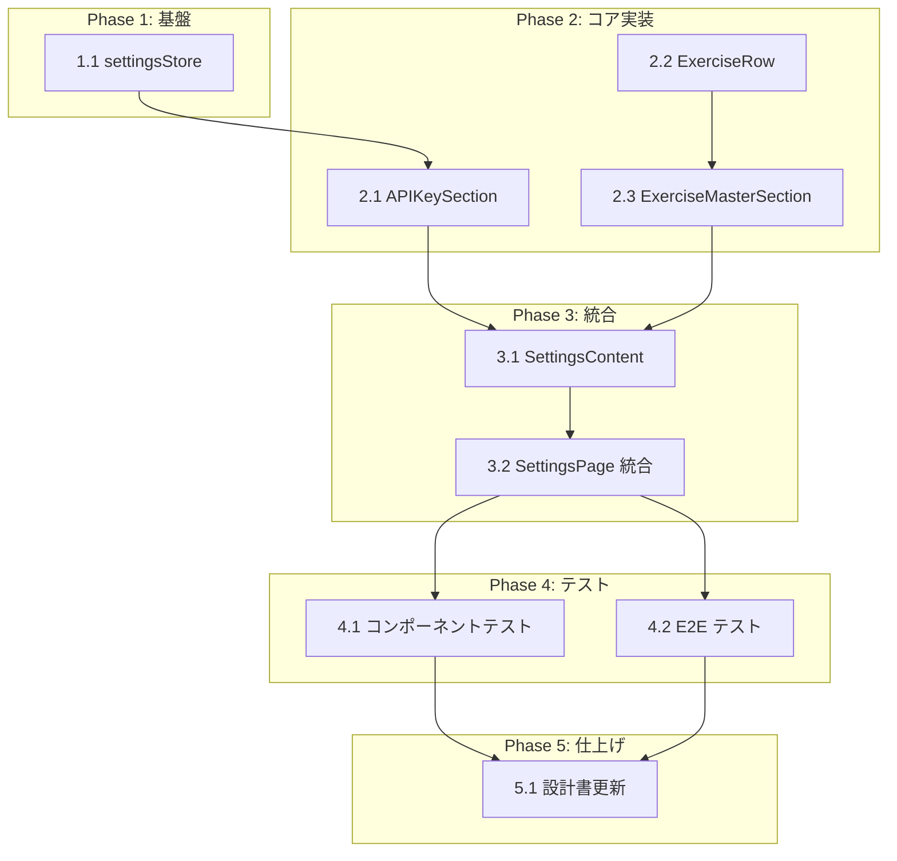

# 設定画面 タスク分解

## タスク一覧

### Phase 1: 基盤

| # | タスク | 説明 | 完了条件 | 依存 |
|:--|:------|:-----|:--------|:----|
| 1.1 | settingsStore 実装 | `src/stores/settingsStore.ts` に Zustand ストアを実装。state: `apiKey`, `hasApiKey`。actions: `setApiKey`, `deleteApiKey`, `loadApiKey`。localStorage キー `gymini:api-key` で直接永続化。全操作を `try-catch` でラップ（T-002） | `setApiKey` で localStorage に保存、`deleteApiKey` で削除、`loadApiKey` で読み込み。`hasApiKey` が `apiKey !== ''` の派生値。localStorage エラー時のフォールバック。ユニットテスト通過 | - |

### Phase 2: コア実装

| # | タスク | 説明 | 完了条件 | 依存 |
|:--|:------|:-----|:--------|:----|
| 2.1 | APIKeySection コンポーネント | `src/components/settings/APIKeySection.tsx` を作成。settingsStore から `apiKey`, `hasApiKey`, `setApiKey`, `deleteApiKey` を取得。入力フィールド（`type="password"` / `type="text"` 切替）+ PhEye/PhEyeSlash トグルボタン + ステータス行（接続済み 🟢 / 未設定）+ 削除ボタン（PhTrash）。セクションカード: `bg-white rounded-2xl p-4 shadow-sm border border-zinc-100` | マスク切替テスト、APIキー入力→localStorage 保存テスト、削除テスト、ステータス表示切替テスト。タップターゲット 44px 以上。コンポーネントテスト通過 | 1.1 |
| 2.2 | ExerciseRow コンポーネント | `src/components/settings/ExerciseRow.tsx` を作成。props: `exercise: Exercise`, `onEdit`, `onDelete`。種目名 + 編集ボタン（PhPencilSimple）+ 削除ボタン（PhTrash）。区切り: `border-b border-zinc-100` | 種目名表示、編集ボタンクリックで `onEdit` コールバック、削除ボタンクリックで `onDelete` コールバック。コンポーネントテスト通過 | - |
| 2.3 | ExerciseMasterSection コンポーネント | `src/components/settings/ExerciseMasterSection.tsx` を作成。ExerciseRepository（外部）から種目一覧を取得。検索フィールド（PhMagnifyingGlass + input）でリアルタイムフィルタ。ExerciseRow 一覧 + 追加ボタン（PhPlus + 「種目を追加」）。セクションカード: `bg-white rounded-2xl p-4` | 検索入力で一覧がリアルタイム更新。追加ボタンで新規種目追加。編集・削除が ExerciseRepository に反映。コンポーネントテスト通過 | 2.2 |

### Phase 3: 統合

| # | タスク | 説明 | 完了条件 | 依存 |
|:--|:------|:-----|:--------|:----|
| 3.1 | SettingsContent コンポーネント | `src/components/settings/SettingsContent.tsx` を作成。タイトル「設定」+ APIKeySection + ExerciseMasterSection を統合配置。レイアウト: `px-4 pt-20 pb-8 space-y-6` | 両セクションが正しく表示されること。統合テスト通過 | 2.1, 2.3 |
| 3.2 | SettingsPage への統合 | navigation の `src/pages/SettingsPage.tsx` に SettingsContent を配置。`loadApiKey` をコンポーネントマウント時に呼び出し | 設定画面アクセス時に APIKeySection + ExerciseMasterSection が表示。Xボタンで遷移元に戻れること。統合テスト通過 | 3.1 |

### Phase 4: テスト

| # | タスク | 説明 | 完了条件 | 依存 |
|:--|:------|:-----|:--------|:----|
| 4.1 | コンポーネントテスト拡充 | APIKeySection（入力→保存、マスク切替、削除、ステータス表示）、ExerciseMasterSection（検索フィルタ、追加、編集、削除）の網羅的テスト。settingsStore のユニットテスト（localStorage モック） | 全 FR のテスト通過。localStorage 不可時のフォールバック（T-002）テスト通過 | 3.2 |
| 4.2 | E2E テスト | Playwright で 歯車アイコン → 設定画面 → APIキー入力・マスク切替・削除 → 種目検索・追加・編集・削除 → Xボタンで遷移元に戻る の全フロー | `npx playwright test` 通過。FR-001〜FR-009 の全フロー検証 | 3.2 |

### Phase 5: 仕上げ

| # | タスク | 説明 | 完了条件 | 依存 |
|:--|:------|:-----|:--------|:----|
| 5.1 | 設計書の実装ステータス更新 | `index_design.md` の `impl-status` を `"implemented"` に、各モジュールのステータスを 🟢 に更新 | 全モジュールが 🟢。`impl-status: "implemented"` | 4.1, 4.2 |

## 依存関係図



## 実装の注意事項

- **navigation 依存**: SettingsPage（Xボタン + layout 外ルート）は navigation タスクで作成済みの前提。本モジュールはコンテンツ部分のみ
- **ExerciseRepository 依存**: exercise-master モジュールの ExerciseRepository が先行実装されている前提。未実装の場合はモック/スタブで進行可能
- **settingsStore の共有**: navigation の GearIcon が `hasApiKey` を参照するため、settingsStore は最優先で実装する
- **B-001**: APIキーは localStorage にのみ保存。外部送信なし
- **T-002**: settingsStore の全 localStorage 操作を try-catch でラップ。エラー時はデフォルト状態にフォールバック
- **T-003**: 全タップターゲットは `min-h-[44px] min-w-[44px]` 以上
- **onChange 即保存**: APIキーは入力時に即座に localStorage に保存。保存ボタンは不要（design §9.1）
- **デバウンスなし**: 種目検索は localStorage 読み取りのため即時フィルタ（design §9.1）

## 参照ドキュメント

- 抽象仕様書: [index_spec.md](../../specification/settings/index_spec.md)
- 技術設計書: [index_design.md](../../specification/settings/index_design.md)
- PRD: [index.md](../../requirement/settings/index.md)

## 要求カバレッジ

| 要求 ID | 要件 | 対応タスク |
|:--------|:----|:----------|
| FR-001 | 設定画面を /settings ルートで表示 | 3.2（navigation 実装済みの SettingsPage にコンテンツ統合） |
| FR-002 | Xボタンで遷移元に戻る | 3.2（navigation 実装済み） |
| FR-003 | APIキー設定セクション表示 | 2.1, 3.1 |
| FR-004 | APIキーを localStorage に保存・削除 | 1.1, 2.1 |
| FR-005 | APIキー表示/非表示トグル | 2.1 |
| FR-006 | APIキー未設定時のステータス表示 | 1.1（hasApiKey）, 2.1（ステータス行） |
| FR-007 | 種目マスター管理セクション表示 | 2.2, 2.3, 3.1 |
| FR-008 | 種目リアルタイム検索 | 2.3 |
| FR-009 | 種目の手動追加・編集・削除 | 2.2, 2.3 |
| NFR-001 | APIキーが localStorage 以外に送信されない | 1.1（localStorage 直接操作）, 4.1 |
| NFR-002 | 種目検索のリアルタイム更新 | 2.3（デバウンスなし即時フィルタ） |

**カバレッジ**: 9/9 FR + 2/2 NFR = **100%**

## 推奨する手動検証

- [ ] タスクの粒度が適切か（1タスク = 数時間〜1日程度）を確認
- [ ] 依存関係図が論理的に正しいか確認
- [ ] 要求カバレッジ表で漏れがないことを確認
- [ ] Phase 分類が適切か確認

## 検証コマンド

```bash
# 関連する設計書との整合性を確認
/check-spec settings

# 仕様の不明点がないか確認
/clarify settings

# チェックリストを生成して品質基準を明確化
/checklist settings
```
