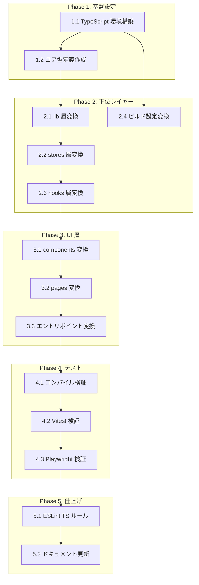

# TypeScript移行 タスク分解

## タスク一覧

### Phase 1: 基盤設定

| #   | タスク | 説明 | 完了条件 | 依存 |
|:----|:------|:-----|:--------|:----|
| 1.1 | TypeScript 環境構築 | `typescript` を devDependencies に追加。`tsconfig.json` を `"strict": true`、`"moduleResolution": "bundler"`、`"jsx": "react-jsx"` で作成。`package.json` に `"typecheck": "tsc --noEmit"` スクリプトを追加 | `npm run typecheck` が実行できる（この時点でエラーが出ていても可）。`tsconfig.json` が存在し `strict: true` が設定されている | - |
| 1.2 | コア型定義作成 | `src/types/index.ts` を新規作成。`Exercise`, `PendingSet`, `WorkoutSet`, `WorkoutExercise`, `WorkoutRecord` の5型を設計書の定義通りに実装 | `src/types/index.ts` が存在し全5型が `export interface` でエクスポートされている。`tsc --noEmit` でこのファイル単体のエラーがゼロ | 1.1 |

### Phase 2: コア実装（下位レイヤー）

| #   | タスク | 説明 | 完了条件 | 依存 |
|:----|:------|:-----|:--------|:----|
| 2.1 | lib 層変換 | `src/lib/exerciseRepository.js` → `.ts`、`src/lib/exerciseRepository.test.js` → `.test.ts`、`src/lib/workoutRepository.js` → `.ts`、`src/lib/workoutRepository.test.js` → `.test.ts` にリネーム。戻り値に `Exercise[]` / `WorkoutRecord[]` 型を付与。`workoutRepository.ts` の `getAll()` に `as WorkoutRecord[]` キャストと既存 try-catch を確認 | 4ファイルが `.ts` 拡張子になり、`tsc --noEmit` でこれらのファイルのエラーがゼロ | 1.2 |
| 2.2 | stores 層変換 | `src/stores/workoutStore.js` → `.ts`、`src/stores/workoutStore.test.js` → `.test.ts` にリネーム。`WorkoutState`、`WorkoutActions` インターフェースを定義し、`type WorkoutStore = WorkoutState & WorkoutActions`。`create<WorkoutStore>()((set, get) => ({ ... }))` カリー化構文に変更 | 2ファイルが `.ts` 拡張子になり、`tsc --noEmit` でエラーがゼロ。`draftWorkoutId: string \| null`、全アクション（`loadWorkouts`、`confirmSet_internal`、`updateWorkout` 含む）が型付けされている | 2.1 |
| 2.3 | hooks 層変換 | `src/hooks/useWorkoutSession.js` → `.ts`、`src/hooks/useWorkoutSession.test.js` → `.test.ts`、`src/hooks/useWorkoutList.js` → `.ts`、`src/hooks/useWorkoutList.test.js` → `.test.ts` にリネーム。各フックの戻り値型を定義 | 4ファイルが `.ts` 拡張子になり、`tsc --noEmit` でエラーがゼロ | 2.2 |
| 2.4 | ビルド設定変換 | `vite.config.js` → `vite.config.ts` にリネーム（`defineConfig` 型付け、`setupFiles` を `'./src/test/setup.ts'` に更新）。`src/test/setup.js` → `src/test/setup.ts` にリネーム（`@testing-library/jest-dom` 型参照確認） | 2ファイルが `.ts` 拡張子になり、`npm run build` が成功し、`vitest run` がエラーなく起動する | 1.1 |

### Phase 3: UI 層変換

| #   | タスク | 説明 | 完了条件 | 依存 |
|:----|:------|:-----|:--------|:----|
| 3.1 | components 変換 | `src/components/ExerciseSection.jsx` → `.tsx`（`ExerciseSectionProps` 定義）、`src/components/ExerciseSection.test.jsx` → `.test.tsx`、`src/components/SetRowInput.jsx` → `.tsx`（`SetRowInputProps` 定義）、`src/components/SetRowInput.test.jsx` → `.test.tsx`、`src/components/WorkoutCard.jsx` → `.tsx`（`WorkoutCardProps` 定義）にリネーム・型付け | 5ファイルが `.tsx`/`.test.tsx` 拡張子になり、`tsc --noEmit` でエラーがゼロ。`React.FC` を使わず props 型を引数で受けている | 2.3 |
| 3.2 | pages 変換 | `src/pages/WorkoutFormPage.jsx` → `.tsx`（`WorkoutFormPageProps` 定義）、`src/pages/WorkoutFormPage.test.jsx` → `.test.tsx`、`src/pages/WorkoutListPage.jsx` → `.tsx`（props なし）にリネーム・型付け | 3ファイルが `.tsx`/`.test.tsx` 拡張子になり、`tsc --noEmit` でエラーがゼロ | 3.1 |
| 3.3 | エントリポイント変換 | `src/App.jsx` → `src/App.tsx`（props なし）、`src/main.jsx` → `src/main.tsx`（`document.getElementById` の null チェック追加）にリネーム・型付け | 2ファイルが `.tsx` 拡張子になり、`tsc --noEmit` 全体でエラーがゼロ（`npm run typecheck` 成功） | 3.2 |

### Phase 4: テスト・検証

| #   | タスク | 説明 | 完了条件 | 依存 |
|:----|:------|:-----|:--------|:----|
| 4.1 | TypeScript コンパイル検証 | `npm run typecheck`（`tsc --noEmit`）を実行し、コンパイルエラーがゼロであることを確認。`npm run build` が成功することを確認 | `npm run typecheck` の exit code が 0。`npm run build` の exit code が 0 | 3.3 |
| 4.2 | Vitest ユニットテスト検証 | `vitest run --coverage` を実行し、全テストが通過し、カバレッジが ≥80%（UI は ≥60%）であることを確認 | `vitest run` で全テストグリーン。カバレッジレポートで目標値を達成 | 4.1 |
| 4.3 | Playwright E2E テスト検証 | `npx playwright test` を実行し、全16件のテストが通過することを確認 | `playwright test` で全16件パス | 4.2 |

### Phase 5: 仕上げ

| #   | タスク | 説明 | 完了条件 | 依存 |
|:----|:------|:-----|:--------|:----|
| 5.1 | ESLint TypeScript ルール追加 | `@typescript-eslint/eslint-plugin` と `@typescript-eslint/parser` を devDependencies に追加。ESLint 設定に `@typescript-eslint/no-explicit-any` ルールを追加 | `eslint` 実行時に `any` 型使用が自動検出される | 4.3 |
| 5.2 | ドキュメント更新 | `typescript-migration_design.md` の `impl-status` を `"not-implemented"` → `"implemented"` に更新。`impl-status` の進捗表を最新状態に更新 | 設計書の全モジュールステータスが 🟢 になり、`impl-status: "implemented"` に変更されている | 5.1 |

---

## 依存関係図

---

## 実装の注意事項

- **振る舞いの変更禁止**: 型注釈の付与のみ。既存ロジックを変更しない
- **`any` 型禁止**: `// @ts-ignore` によるエラー回避も禁止（T-001）
- **`React.FC` 禁止**: props 型を関数引数で直接受ける
- **Zustand カリー化構文**: `create<WorkoutStore>()(...)` の二重括弧必須（TypeScript 型推論のため）
- **`PendingSet` の実際の型**: `weight: number, reps: number, memo: string`（SetRowInput で `Number()` 変換済み）
- **`WorkoutSet` の `memo`**: `confirmSet_internal` で pendingSet がスプレッドされるため `memo: string` が含まれる
- **`vite.config.ts` の `setupFiles` 更新**: `setup.js` → `setup.ts` に合わせてパスも更新すること
- **移行順序**: 設計書の決定通り一括変換（中間状態でのビルドエラーを最小化するため下位→上位レイヤー順）

---

## 参照ドキュメント

- 抽象仕様書: [typescript-migration_spec.md](../../specification/typescript-migration_spec.md)
- 技術設計書: [typescript-migration_design.md](../../specification/typescript-migration_design.md)

---

## 要求カバレッジ

| 要求 ID | 要求内容 | 対応タスク |
|:--------|:---------|:---------|
| FR-001 | `src/**/*.js` → `.ts`、`src/**/*.jsx` → `.tsx` リネーム | 2.1, 2.2, 2.3, 2.4, 3.1, 3.2, 3.3 |
| FR-002 | `tsconfig.json` を `"strict": true` で作成 | 1.1 |
| FR-003 | `any` 型をコードベース内で使用しない | 2.1–3.3（全変換タスク）、5.1 |
| FR-004 | コアデータモデル型定義（Exercise / WorkoutSet / WorkoutRecord）確立 | 1.2 |
| FR-005 | コンポーネント props を型定義（`React.FC` 不使用） | 3.1, 3.2 |
| FR-006 | Zustand ストアの state / actions を型定義 | 2.2 |
| FR-007 | カスタムフックの引数・戻り値を型定義 | 2.3 |
| FR-008 | 移行後も既存 Vitest テストが全て通過 | 4.2 |
| FR-009 | 移行後も既存 Playwright E2E テストが全て通過 | 4.3 |
| FR-010 | `vite.config.js` → `vite.config.ts` 変換 | 2.4 |
| FR-011 | `src/test/setup.js` → `src/test/setup.ts` 変換 | 2.4 |
| NFR-001 | TypeScript コンパイルエラー 0 | 4.1 |
| NFR-002 | テストカバレッジ ≥ 80%（UI は ≥ 60%） | 4.2 |
| NFR-003 | `npm run build` が成功する | 4.1 |
| NFR-004 | 型定義が `src/types/` に集約され再利用可能 | 1.2 |

---

## 推奨する手動検証

- [ ] タスクの粒度が適切か（1タスク = 数時間〜1日程度）を確認
- [ ] 依存関係図が論理的に正しいか確認
- [ ] 要求カバレッジ表で漏れがないことを確認（FR-001〜FR-011、NFR-001〜NFR-004 全カバー済み）
- [ ] Phase 分類が適切か確認
