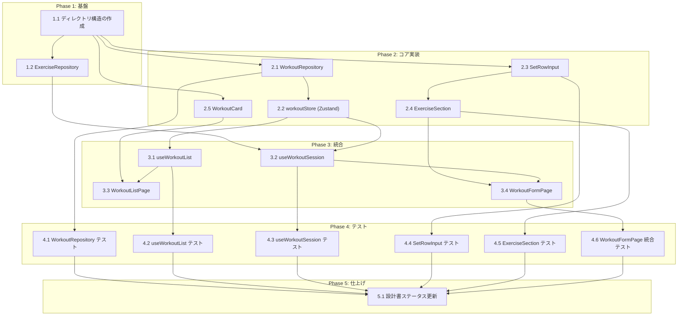

# ワークアウト記録管理 タスク分解

## メタ情報

| 項目 | 内容 |
|:---|:---|
| 機能名 | ワークアウト記録管理 |
| 設計書 | `.sdd/specification/workout/index_design.md` |
| 仕様書 | `.sdd/specification/workout/index_spec.md` |
| 要求仕様書 | `.sdd/requirement/workout/index.md` |
| 作成日 | 2026-03-08 |

---

## タスク一覧

### Phase 1: 基盤

| # | タスク | 説明 | 完了条件 | 依存 |
|:---|:---|:---|:---|:---|
| 1.1 | ディレクトリ構造の作成 | `src/lib/`, `src/stores/`, `src/hooks/`, `src/pages/`, `src/components/` を作成する | 各ディレクトリが存在し、空の index や プレースホルダーが配置されている | - |
| 1.2 | ExerciseRepository の実装 | `src/lib/exerciseRepository.js` を実装する。localStorage から種目マスターデータを読み取る純粋関数。`search(query)` によるキーワード検索が対象 | `search(query)` で部分一致検索ができる。存在しない場合は `[]` を返す。Reactを一切 import しない | 1.1 |

### Phase 2: コア実装

| # | タスク | 説明 | 完了条件 | 依存 |
|:---|:---|:---|:---|:---|
| 2.1 | WorkoutRepository の実装 | `src/lib/workoutRepository.js` を実装する。`getById`, `listByDateDesc`, `listByDate`, `create`, `update`, `remove` の全関数を実装する | 全CRUD関数が正常動作する。`remove`（`delete` は予約語のため使用禁止）。読み取り失敗時は `[]` にフォールバック。Reactを一切 import しない | 1.1 |
| 2.2 | workoutStore (Zustand) の実装 | `src/stores/workoutStore.js` を実装する。`workouts`, `draftDate`, `draftExercises`, `draftMemo`, `draftWorkoutId` の State と全 Actions を実装する | State と全 Actions（`loadWorkouts`, `deleteWorkout`, `startSession`, `addExercise`, `addSet`, `updateSet`, `removeSet`, `setDraftMemo`, `saveSession`, `cancelSession`, `updateWorkout`）が設計書のインターフェース定義通りに動作する。UI から直接 import されない設計になっている | 2.1 |
| 2.3 | SetRowInput コンポーネントの実装 | `src/components/SetRowInput.jsx` を実装する。セット入力行（重量・回数・メモ）の表示と入力、FR-006（前セット自動入力）、FR-007（自動フォーカス）、FR-008（確定済みセットのインライン編集）を担当する | `pendingSet` の表示・編集が動作する。種目選択後・セット追加後に重量フィールドへ自動フォーカスする（`useEffect` + `ref.current.focus()`）。確定済みセットをタップすると編集可能状態に切り替わる | 1.1 |
| 2.4 | ExerciseSection コンポーネントの実装 | `src/components/ExerciseSection.jsx` を実装する。1種目のセクション（種目名 + 確定済みセット一覧 + `SetRowInput`）を担当する。「セット追加」ボタンのハンドリングを含む | 確定済みセットの一覧表示、`SetRowInput` の配置、「セット追加」タップ時に `pendingSet` を確定して次の `pendingSet` を前セット値でコピー初期化（メモは空）する動作が正しい | 2.3 |
| 2.5 | WorkoutCard コンポーネントの実装 | `src/components/WorkoutCard.jsx` を実装する。1ワークアウトの表示カード（日付・種目サマリー・削除ボタン）を担当する | 日付・種目名・セット数のサマリーが表示される。種目名は `exerciseName`（スナップショット）を優先表示する（`exerciseId` の存在確認は行わない）。削除ボタンタップ時に `onDelete` コールバックが呼ばれる | 1.1 |

### Phase 3: 統合

| # | タスク | 説明 | 完了条件 | 依存 |
|:---|:---|:---|:---|:---|
| 3.1 | useWorkoutList Hook の実装 | `src/hooks/useWorkoutList.js` を実装する。`workoutStore` をラップして `workouts`（日付降順）と `deleteWorkout` を UI に公開する | `{ workouts, deleteWorkout }` が正しく返される。マウント時に自動ロードされる | 2.2 |
| 3.2 | useWorkoutSession Hook の実装 | `src/hooks/useWorkoutSession.js` を実装する。`draftDate`, `draftExercises`, `draftMemo`, `startSession`, `startEditSession`, `addExercise`, `addSet`, `updateSet`, `removeSet`, `setDraftMemo`, `saveSession`, `cancelSession`, `searchExercises` を公開する | 全 API が設計書の定義通り動作する。`startEditSession(workout)` で既存ワークアウトを編集モードで開始できる。`saveSession()` が `draftWorkoutId` に基づき新規作成/更新を自動判別する。`searchExercises(query)` が内部で `ExerciseRepository` を呼ぶ | 2.2, 1.2 |
| 3.3 | WorkoutListPage の実装 | `src/pages/WorkoutListPage.jsx` を実装する。`useWorkoutList` を利用した一覧表示と削除機能を持つ画面 | ワークアウト一覧が日付降順で表示される。`WorkoutCard` を使ってサマリーを表示。削除ボタンで削除できる。`WorkoutFormPage` への遷移ボタンがある | 3.1, 2.5 |
| 3.4 | WorkoutFormPage の実装 | `src/pages/WorkoutFormPage.jsx` を実装する。`useWorkoutSession` を利用したセッション形式の記録フォーム画面。複数種目の連続記録・保存・キャンセルを担当する | 日付入力、種目検索・選択、`ExerciseSection` の追加、ワークアウトメモ入力、保存・キャンセルが動作する。保存後に一覧画面へ遷移する。新規作成・編集の両モードに対応する | 3.2, 2.4 |

### Phase 4: テスト

| # | タスク | 説明 | 完了条件 | 依存 |
|:---|:---|:---|:---|:---|
| 4.1 | WorkoutRepository ユニットテスト | `WorkoutRepository` の全CRUD関数をテストする。localStorage のモックを使用する | `getById`, `listByDateDesc`, `listByDate`, `create`, `update`, `remove` が全てテスト済み。読み取り失敗時の空配列フォールバックが確認済み | 2.1 |
| 4.2 | useWorkoutList ユニットテスト | `useWorkoutList` の一覧取得・削除アクションをテストする | ワークアウト一覧取得（日付降順）と削除が正しく動作することを確認済み | 3.1 |
| 4.3 | useWorkoutSession ユニットテスト | `useWorkoutSession` の `startSession`, `addExercise`, `addSet`, `updateSet`, `saveSession`（新規作成・更新の両ケース）をテストする | 各アクションが仕様通りに State を変化させることを確認済み。`saveSession()` が `draftWorkoutId` に応じて `create`/`update` を切り替えることを確認済み | 3.2 |
| 4.4 | SetRowInput コンポーネントテスト | FR-006（前セット自動入力）と FR-007（自動フォーカス）、FR-008（インライン編集）の動作をコンポーネントテストで確認する | 前セット値が初期入力されていること、自動フォーカスが発火すること、確定済みセットのインライン編集が動作することを確認済み | 2.3 |
| 4.5 | ExerciseSection コンポーネントテスト | 「セット追加」フローの主要インタラクションをテストする | セット追加時に `pendingSet` が確定されて次の `pendingSet` に前セット値がコピーされることを確認済み | 2.4 |
| 4.6 | WorkoutFormPage 統合テスト | `useWorkoutSession` をモックして複数種目セッション→保存の完全フローをテストする（FR-005 完全フロー） | 複数種目を追加して保存するフローが動作することを確認済み。hooks をモックして UI の動作を検証する | 3.4 |

### Phase 5: 仕上げ

| # | タスク | 説明 | 完了条件 | 依存 |
|:---|:---|:---|:---|:---|
| 5.1 | 設計書の実装ステータス更新 | `index_design.md` の「実装ステータス」テーブルを全モジュール 🟢 実装済み に更新する。`impl-status` フロントマターを `implemented` に変更する | 設計書の全モジュールが 🟢 状態に更新されている | 4.1, 4.2, 4.3, 4.4, 4.5, 4.6 |

---

## 依存関係図



---

## 実装の注意事項

- **`delete` は JS 予約語**: `WorkoutRepository` の削除関数は必ず `remove` を使用する（spec FR-001 参照）
- **Store の公開範囲**: `workoutStore` は UI から直接 import しない。`useWorkoutList` / `useWorkoutSession` 経由のみ
- **自動入力の対象**: 前セット値の引き継ぎは重量・回数のみ。メモは毎回空にする（FR-006）
- **自動フォーカスのタイミング**: 種目選択後とセット追加後の両方で `useEffect` + `ref.current.focus()` を使用する（FR-007）
- **インライン編集の実装**: `updateSet(exerciseIndex, setIndex, set)` は `pendingSet` ではなく、確定済みの `sets[]` 要素を更新する（FR-008）
- **セッション保存の自動判別**: `saveSession()` は `draftWorkoutId` が `null` なら `create`、文字列なら `update` を呼ぶ
- **exerciseName の優先表示**: `WorkoutCard` は `exerciseName`（スナップショット）を優先表示し、`exerciseId` の存在確認は行わない
- **localStorage のエラーハンドリング**: 書き込みは `try/catch` でラップ。読み取り失敗時は `[]` にフォールバック（NFR-002）
- **ID生成**: `crypto.randomUUID()` を使用する（外部依存ゼロ）

---

## 要求カバレッジ

| 要求ID | 要件内容 | 対応タスク |
|:---|:---|:---|
| FR-001 | ワークアウトの追加・編集・削除 | 2.1, 2.2, 3.2, 3.3, 3.4 |
| FR-002 | ワークアウト一覧を日付降順で表示 | 2.1, 2.2, 3.1, 3.3 |
| FR-003 | セット単位で重量(kg)・回数・メモを管理 | 2.1, 2.2, 2.3, 2.4 |
| FR-004 | ワークアウト全体のメモを記録 | 2.2, 3.2, 3.4 |
| FR-005 | 1回のセッション内で複数の種目を連続して追加・記録 | 2.2, 3.2, 3.4, 4.6 |
| FR-006 | 2セット目以降は前セットの重量・回数を自動入力 | 2.3, 2.4, 4.4 |
| FR-007 | 種目選択後、最初のセット入力フィールドに自動フォーカス | 2.3, 4.4 |
| FR-008 | 確定済みセットのインライン編集 | 2.2, 2.3, 3.2, 4.4 |
| NFR-001 | 画面遷移2ステップ以内 | 3.3, 3.4 |
| NFR-002 | データ損失・破損防止（localStorage エラーハンドリング） | 2.1, 4.1 |

---

## 参照ドキュメント

- 抽象仕様書: [index_spec.md](../../specification/workout/index_spec.md)
- 技術設計書: [index_design.md](../../specification/workout/index_design.md)
- 要求仕様書: [index.md](../../requirement/workout/index.md)

---

## 推奨する手動検証

- [ ] タスクの粒度が適切か（1タスク = 数時間〜1日程度）を確認
- [ ] 依存関係図が論理的に正しいか確認
- [ ] 要求カバレッジ表で漏れがないことを確認
- [ ] Phase 分類が適切か確認

## 検証コマンド

```bash
# 関連する設計書との整合性を確認
/check-spec workout/index

# 仕様の不明点がないか確認
/clarify workout/index

# チェックリストを生成して品質基準を明確化
/checklist workout/index
```
