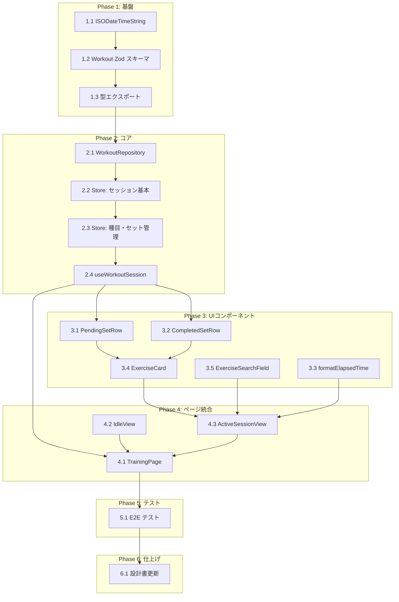

# ワークアウト記録管理 タスク分解

## メタ情報

| 項目 | 内容 |
|:---|:---|
| 機能名 | ワークアウト記録管理 |
| 設計書 | `.sdd/specification/workout/index_design.md` |
| 仕様書 | `.sdd/specification/workout/index_spec.md` |
| PRD | `.sdd/requirement/workout/index.md` |
| 作成日 | 2026-04-10 |

## タスク一覧

### Phase 1: 基盤

| # | タスク | 説明 | 完了条件 | 依存 |
|:---|:---|:---|:---|:---|
| 1.1 | ISODateTimeString branded type 追加 | `src/schemas/date.ts` に `isoDateTimeSchema`, `ISODateTimeString` 型, `toISODateTimeString()`, `nowISODateTimeString()` を追加。既存の `DateString` と同居 | Zod パースの正常系・異常系テストが通る。`DateString` の既存テストが壊れていない | - |
| 1.2 | Workout Zod スキーマ定義 | `src/schemas/workout.ts` に `workoutSetSchema`, `workoutExerciseSchema`, `workoutSchema` を定義。`dateStringSchema`, `isoDateTimeSchema` を import して使用 | 正常なJSONのパース成功、不正データ（日付形式違い・weight負数・reps小数等）のパース失敗テストが通る | 1.1 |
| 1.3 | Workout 型定義のエクスポート | `workoutSchema` から `Workout`, `WorkoutExercise`, `WorkoutSet`, `WorkoutInput` 型を `z.infer` で導出しエクスポート | 型が他モジュールから import 可能。`WorkoutInput = Omit<Workout, 'id' \| 'createdAt' \| 'updatedAt'>` が成立 | 1.2 |

### Phase 2: コア実装

| # | タスク | 説明 | 完了条件 | 依存 |
|:---|:---|:---|:---|:---|
| 2.1 | WorkoutRepository 実装 | `src/lib/workoutRepository.ts` に `save`, `remove`, `getById`, `listByDateDesc`, `listByDate` を純粋関数として実装。localStorage 読み取り時は Zod パースで検証、失敗時は `[]` フォールバック（T-002） | 全5関数のユニットテストが通る。localStorage モックで CRUD の正常系・異常系（不正JSON、空ストレージ）をカバー | 1.3 |
| 2.2 | workoutSessionStore 実装（セッション基本 + persist） | `src/stores/workoutSessionStore.ts` に Zustand + persist store を実装。state: `isActive`, `startedAt`, `draftExercises`。actions: `startSession`, `endSession`。persist で `isActive`, `startedAt`, `draftExercises` を `gymini:workout-session` キーで永続化。`onRehydrateStorage` でエラーハンドリング（T-002） | `startSession()` で `isActive=true`, `startedAt` がセット、`draftExercises=[]`。`endSession()` で `WorkoutRepository.save` が呼ばれ、state がリセット。リロード後にセッションが復元される。ユニットテスト通過 | 2.1 |
| 2.3 | workoutSessionStore 実装（種目・セット管理） | `addExercise`, `activateExercise`, `completeSet`, `editCompletedSet`, `deleteCompletedSet`, `toggleExerciseCard` を追加 | `addExercise`: recording 状態で追加 + 他の recording を idle 降格。`activateExercise`: idle→recording + 排他制御。`completeSet`: pendingSet→sets + 次 pendingSet 自動作成（前セット値）。`editCompletedSet`: sets→pendingSet 移動。`deleteCompletedSet`: sets から削除。`toggleExerciseCard`: collapsed↔idle 切替。全アクションのユニットテスト通過 | 2.2 |
| 2.4 | useWorkoutSession hook 実装 | `src/hooks/useWorkoutSession.ts` に store をラップする hook を実装。`elapsedSeconds` を `setInterval` で毎秒更新（FR-032）。`searchExercises` で ExerciseRepository を内部呼出し | hook が store の全 state/action を公開。`elapsedSeconds` が `startedAt` から正しく計算される。`searchExercises` が ExerciseRepository を呼ぶ。ユニットテスト通過 | 2.3 |

### Phase 3: 統合（UIコンポーネント）

| # | タスク | 説明 | 完了条件 | 依存 |
|:---|:---|:---|:---|:---|
| 3.1 | PendingSetRow コンポーネント | `src/components/workout/PendingSetRow.tsx`。セット番号 + 重量/回数入力フィールド + チェックボタン。左端黒バー。props: `setNumber`, `pendingSet`, `onComplete` | チェックタップで `onComplete` が呼ばれる。重量/回数の入力・表示が正しい。タップターゲット 44px 確保（T-003）。コンポーネントテスト通過 | 2.4 |
| 3.2 | CompletedSetRow コンポーネント | `src/components/workout/CompletedSetRow.tsx`。ゴミ箱 + 重量/回数表示 + 鉛筆。props: `set`, `onEdit`, `onDelete` | ゴミ箱タップで `onDelete`、鉛筆タップで `onEdit` が呼ばれる。`bg-zinc-50 rounded-xl` スタイル適用。コンポーネントテスト通過 | 2.4 |
| 3.3 | formatElapsedTime ユーティリティ | `src/lib/formatElapsedTime.ts` に `elapsedSeconds` → `"HH:MM:SS"` 形式のフォーマット関数を実装。navigation の GearIcon が `elapsedTime` prop として使用する | 0→`"00:00:00"`、3672→`"01:01:12"` の変換テスト通過 | - |
| 3.4 | ExerciseCard コンポーネント | `src/components/workout/ExerciseCard.tsx`。3状態（collapsed/idle/recording）に応じた表示切替。内部で CompletedSetRow, PendingSetRow を使用。props: `draftExercise`, `exerciseIndex`, `onActivate`, `onComplete`, `onEdit`, `onDelete`, `onToggle` | collapsed: ヘッダーのみ + セット数サマリー。idle: 完了セット + 「+」ボタン。recording: 完了セット + PendingSetRow。ヘッダータップで `onToggle`。コンポーネントテスト通過 | 3.1, 3.2 |
| 3.5 | ExerciseSearchField コンポーネント | `src/components/workout/ExerciseSearchField.tsx`。部分一致検索フィールド + 候補ドロップダウン。props: `onSelectExercise`, `searchExercises` | 入力で候補表示、選択で `onSelectExercise` コールバック。未登録種目の新規追加対応。コンポーネントテスト通過 | - |

### Phase 4: 統合（ページ）

| # | タスク | 説明 | 完了条件 | 依存 |
|:---|:---|:---|:---|:---|
| 4.1 | TrainingPage 実装 | `src/pages/TrainingPage.tsx`。`useWorkoutSession().isActive` で IdleView（FRAME1）/ ActiveSessionView（FRAME2）を切替。ルートファイル `src/routes/_app/training.tsx` は navigation タスクで作成済みの前提 | `isActive=false` → IdleView 表示。`isActive=true` → ActiveSessionView 表示。統合テスト通過 | 2.4, 4.2, 4.3 |
| 4.2 | IdleView（FRAME1）実装 | `src/components/IdleView.tsx`。挨拶 + 「トレーニングを始める」ボタン。props: `onStartTraining`。ボタン: `w-[85%] h-13 bg-black text-white rounded-2xl` | ボタンタップで `onStartTraining` コールバック。タップターゲット 44px 以上。コンポーネントテスト通過 | - |
| 4.3 | ActiveSessionView（FRAME2）実装 | `src/components/workout/ActiveSessionView.tsx`。ExerciseCard 一覧 + ExerciseSearchField を統合。`useWorkoutSession` から全 state/action を取得。終了ボタンとタイマーは navigation の GearIcon が表示するためスコープ外 | 種目追加→セット記録の全フロー動作。統合テスト通過 | 3.3, 3.4, 3.5 |

### Phase 5: テスト

| # | タスク | 説明 | 完了条件 | 依存 |
|:---|:---|:---|:---|:---|
| 5.1 | E2E テスト | Playwright で FRAME1 → FRAME2 → 種目追加 → セット記録（チェック→自動追加→前セット値確認）→ 完了セット編集/削除 → 別種目追加（排他制御確認）→ 終了 → FRAME1 の全フローをテスト | 全 E2E テスト通過。セッションライフサイクル・3状態遷移・排他制御・タイマー表示を検証 | 4.2 |

### Phase 6: 仕上げ

| # | タスク | 説明 | 完了条件 | 依存 |
|:---|:---|:---|:---|:---|
| 6.1 | 設計書の実装ステータス更新 | `index_design.md` の `impl-status` を `"implemented"` に、各モジュールのステータスを 🟢 に更新 | 全モジュールが 🟢。`impl-status: "implemented"` | 5.1 |

## 依存関係図



## 実装の注意事項

- **D-001 Test-First**: 各タスクの実装前にテストを書く。Phase 1〜4 の各タスクにはユニット/コンポーネントテストが含まれる
- **recording 排他制御**: `addExercise` と `activateExercise` の両方で、他の recording 種目を idle に降格するロジックが必要。store のヘルパー関数として `deactivateCurrentRecording()` を内部的に共通化すると良い
- **ExerciseRepository 依存**: exercise-master モジュールの `ExerciseRepository` が先行実装されている前提。未実装の場合はモック/スタブで進行可能
- **ルーティングは navigation 機能が管理**: `/training` ルートは `src/routes/_app/training.tsx` で定義（navigation タスク）。本モジュールは TrainingPage コンポーネントと内部の IdleView / ActiveSessionView を提供する
- **タイマーと終了ボタン**: navigation の GearIcon が `showEndButton`, `elapsedTime`, `onEndSession` props で表示。本モジュールは `useWorkoutSession` の `elapsedSeconds` と `endSession` を提供する側
- **セッション永続化**: workoutSessionStore の Zustand persist でセッション下書きを自動永続化。ページ遷移・リロード後も復元可能（navigation FR-006）
- **T-003 Mobile-First**: 全てのタップターゲットは 44px × 44px 以上。チェックボタンは視覚サイズ `w-7 h-7` + パディングで拡張

## 参照ドキュメント

- 抽象仕様書: [index_spec.md](../../specification/workout/index_spec.md)
- 技術設計書: [index_design.md](../../specification/workout/index_design.md)
- PRD: [index.md](../../requirement/workout/index.md)
- デザインリファレンス: `.sdd/design-system.html` FRAME1, FRAME2

---

## 要求カバレッジ

| 要求ID | 要件 | 対応タスク |
|:---|:---|:---|
| FR-001 | セッションの開始・終了・保存 | 2.2, 4.1, 4.2, 4.3, 5.1 |
| FR-003 | セット単位で重量(kg)と回数を管理 | 1.2, 1.3, 3.1, 3.2 |
| FR-005 | 1セッション内で複数の種目を連続して追加・記録 | 2.3, 3.4, 3.5, 4.3, 5.1 |
| FR-006 | セット完了時に次セットへ前セットの重量・回数を自動入力 | 2.3, 3.1, 5.1 |
| FR-028 | 種目追加時にセット入力行自動作成。チェック完了→次セット自動追加。recording排他制御 | 2.3, 3.1, 3.4, 4.3, 5.1 |
| FR-029 | 完了済みセットの削除・編集 | 2.3, 3.2, 3.4, 5.1 |
| FR-030 | 種目カードの3状態（collapsed・idle・recording）。recordingは同時に1種目のみ | 2.3, 3.4, 5.1 |
| FR-031 | 終了ボタンでセッションを保存して終了 | 2.2, 5.1（終了ボタンUIは navigation GearIcon が担当） |
| FR-032 | セッション経過時間をリアルタイム表示 | 2.4, 3.3, 5.1（タイマーUIは navigation GearIcon が担当） |
| NFR-001 | データ整合性（localStorage永続化） | 1.2, 2.1, 2.2 |

**カバレッジ**: 9/9 FR + 1/1 NFR = **100%**

## 推奨する手動検証

- [ ] タスクの粒度が適切か（1タスク = 数時間〜1日程度）を確認
- [ ] 依存関係図が論理的に正しいか確認
- [ ] 要求カバレッジ表で漏れがないことを確認
- [ ] Phase 分類が適切か確認

## 検証コマンド

```bash
# 関連する設計書との整合性を確認
/check-spec workout

# 仕様の不明点がないか確認
/clarify workout

# チェックリストを生成して品質基準を明確化
/checklist workout
```
