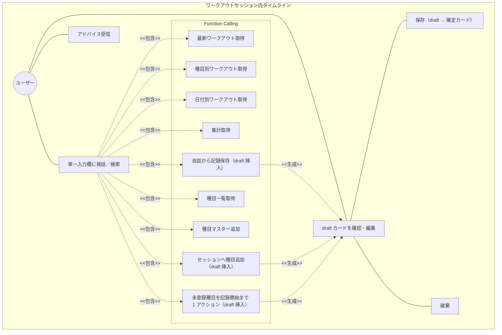

# AIチャット × Function Calling 要求仕様書

**親要求:** [index.md](../index.md) - REQ_005

**関連:** [timeline-migration.md](timeline-migration.md)（旧 UX → タイムライン UX への段階的移行ロードマップ。移行完了後に削除可）

## 概要

Gemini API を用いた対話インターフェースを、独立したチャット画面ではなく **ワークアウトセッション内のタイムライン UX** として提供する。種目カード（ExerciseCard）と AI メッセージ（ChatMessage）が時系列で同一スクロール領域に並び、ユーザーは単一の入力欄から自然言語コマンド・種目検索・AI への質問をすべて行う。AI は Function Calling で文脈を参照する。書き込み操作は **タイムラインに draft カードを直接挿入** する形でユーザー確認を求める（REQ_008）。

draft カード内の編集 UI には、最新 main で確立した PendingSetRow 再利用の編集フォーム（FR_013）と placeholder 提案フロー（FR_015）と Active Session Context Injection（FR_014）と addExerciseAndLog 1 アクション統合（FR_012_09）をそのまま継承する。**配置するコンテナがチャットバブル内インラインからタイムライン上 draft カードに移る**だけで、編集 UI 部品自体は温存される。

チャット履歴はワークアウトセッションのライフサイクルに同期し、セッションがアクティブな間のみリロード復元され、終了で破棄される（B-001 の不要データ残留防止と「セッション中のリロード耐性」を両立）。

---

## 1. ユースケース図



---

## 2. 要求図（SysML Requirements Diagram）

```mermaid
requirementDiagram
    requirement AIChatCoaching {
        id: REQ_005
        text: "ワークアウトセッション内タイムラインで AI コーチングを提供する"
        risk: high
        verifymethod: demonstration
    }

    functionalRequirement ChatConversation {
        id: FR_011
        text: "Gemini APIを用いたチャット会話"
        risk: high
        verifymethod: test
    }

    functionalRequirement FunctionCalling {
        id: FR_012
        text: "AIが会話の文脈から必要なツールを自律的に呼び出す"
        risk: high
        verifymethod: test
    }

    functionalRequirement ToolGetRecentWorkouts {
        id: FR_012_01
        text: "最新n件のワークアウトを取得するツール"
        risk: medium
        verifymethod: test
    }

    functionalRequirement ToolGetByExercise {
        id: FR_012_02
        text: "種目名で部分一致絞り込みするツール"
        risk: medium
        verifymethod: test
    }

    functionalRequirement ToolGetByDate {
        id: FR_012_03
        text: "日付指定でワークアウトを取得するツール"
        risk: medium
        verifymethod: test
    }

    functionalRequirement ToolGetSummary {
        id: FR_012_04
        text: "週・月単位のワークアウト集計ツール"
        risk: medium
        verifymethod: test
    }

    functionalRequirement ToolSaveWorkout {
        id: FR_012_05
        text: "会話から過去日付のワークアウト記録を保存するツール（draft カードとして挿入し、ユーザー編集と承認で確定）"
        risk: high
        verifymethod: test
    }

    functionalRequirement ToolGetExercises {
        id: FR_012_06
        text: "登録済み種目一覧を取得するツール"
        risk: low
        verifymethod: test
    }

    functionalRequirement ToolAddExercise {
        id: FR_012_07
        text: "種目マスターに新規追加するツール（記録は始めない、ユーザー確認必須）"
        risk: low
        verifymethod: test
    }

    functionalRequirement ToolAddExerciseToSession {
        id: FR_012_08
        text: "アクティブセッションに種目（任意でセット群付き）を追加するツール（draft カードとして挿入し、sets 付きは編集フォーム）"
        risk: high
        verifymethod: test
    }

    functionalRequirement ToolAddExerciseAndLog {
        id: FR_012_09
        text: "未登録種目について、種目マスター追加とアクティブセッションへの追加（必要なら自動開始）と最初のセット記録を 1 回の確認で完結させるツール（draft カード + 編集フォーム）"
        risk: high
        verifymethod: test
    }

    requirement AIWriteConfirmation {
        id: REQ_008
        text: "AI の書き込み操作はタイムライン上の draft カードをユーザー確認 UI として用い、承認まではデータに反映しない。重量・回数を伴う提案は draft カード内に編集可能フォームを内包し、全セット weight>0 かつ reps>0 でない限り「保存」は disabled となる"
        risk: high
        verifymethod: test
    }

    functionalRequirement InlineSetEditing {
        id: FR_013
        text: "saveWorkout / addExerciseToSession(sets付き) / addExerciseAndLog の確認 UI は draft カード内に PendingSetRow 再利用の編集可能フォームを描画する。値が 0 のセットは空入力＋プレースホルダ（kg/回）で表示し、全セット weight>0 かつ reps>0 でない限り確定不可。種目名・種目並び替え・種目追加削除は draft カード上では編集不可"
        risk: high
        verifymethod: test
    }

    functionalRequirement ActiveSessionContextInjection {
        id: FR_014
        text: "ワークアウトセッションがアクティブな場合、AI のシステムインストラクションに進行中セッションの状態（開始時刻・各種目の最終セットおよび直近 3 セット・現在入力中の pendingSet）を注入する。トークン圧迫を避けるため要約形式とする"
        risk: medium
        verifymethod: test
    }

    functionalRequirement ExerciseOnlyPlaceholderProposal {
        id: FR_015
        text: "ユーザーが具体値（kg/回数）を伴わずに種目名のみを言及した場合も、AI は placeholder sets [{weight:0, reps:0}] 付きで書き込みツールを呼び出し、draft カード内に編集可能フォームを提示する。セッションアクティブ時は addExerciseToSession（未登録種目は addExerciseAndLog）、非アクティブ時は saveWorkout(date=今日) を使う"
        risk: medium
        verifymethod: test
    }

    functionalRequirement ChatLifecycleSync {
        id: FR_033
        text: "チャット履歴をワークアウトセッションのライフサイクルに同期させる。アクティブ中のみ localStorage に永続化し、startSession / endSession で履歴をクリアする"
        risk: medium
        verifymethod: test
    }

    functionalRequirement TimelineIntegration {
        id: FR_034
        text: "ExerciseCard と ChatMessage を時系列で同一スクロール領域に統合し、recording 状態のカードは画面上部に sticky で固定する"
        risk: high
        verifymethod: test
    }

    functionalRequirement UnifiedInput {
        id: FR_035
        text: "セッション中の唯一の入力欄が、自然言語コマンド・種目検索・AI への質問を兼ねる"
        risk: medium
        verifymethod: test
    }

    functionalRequirement SessionGate {
        id: FR_036
        text: "セッション非アクティブ時、書き込みツールは SESSION_NOT_ACTIVE を返してユーザーにセッション開始を促す（B-002 の補強）"
        risk: high
        verifymethod: test
    }

    AIChatCoaching - contains -> ChatConversation
    AIChatCoaching - contains -> FunctionCalling
    AIChatCoaching - contains -> AIWriteConfirmation
    AIChatCoaching - contains -> InlineSetEditing
    AIChatCoaching - contains -> ActiveSessionContextInjection
    AIChatCoaching - contains -> ExerciseOnlyPlaceholderProposal
    AIChatCoaching - contains -> ChatLifecycleSync
    AIChatCoaching - contains -> TimelineIntegration
    AIChatCoaching - contains -> UnifiedInput
    AIChatCoaching - contains -> SessionGate
    FunctionCalling - contains -> ToolGetRecentWorkouts
    FunctionCalling - contains -> ToolGetByExercise
    FunctionCalling - contains -> ToolGetByDate
    FunctionCalling - contains -> ToolGetSummary
    FunctionCalling - contains -> ToolSaveWorkout
    FunctionCalling - contains -> ToolGetExercises
    FunctionCalling - contains -> ToolAddExercise
    FunctionCalling - contains -> ToolAddExerciseToSession
    FunctionCalling - contains -> ToolAddExerciseAndLog
```



---

## 3. 機能要求の詳細

### FR_011: AIチャット会話

Gemini API を用いた対話を、ワークアウトセッション内のタイムラインで提供する。ユーザーの BYOK API キーで Gemini API に接続する。

**チャットバブル UI スペック（タイムライン内表示）:**

| バブル種別 | 配置 | 背景 | 角丸 | max-width |
|:-----------|:-----|:-----|:-----|:----------|
| ユーザーメッセージ | 右寄せ | `bg-gym-black text-gym-white` | `rounded-[18px] rounded-br-[4px]` | 75% |
| AI 応答（読み取り操作後・テキスト報告） | 左寄せ | `bg-gym-white border-gym-zinc-100 shadow-soft` | `rounded-[18px] rounded-bl-[4px]` | 88% |

- AI メッセージにアバターアイコンは表示しない
- 「AI 確認待ち」種別のチャットバブルは廃止し、書き込み確認は **タイムライン上の draft カード**（REQ_008）に集約する
- 入力バーはタイムラインの下端に固定（FR_035）

**検証方法:** テストによる検証

### FR_012: Function Calling

AI が会話の文脈を解析し、必要に応じて以下のツールを自律的に呼び出す。

**含まれるツール:**

| ツール | 説明 | 操作種別 |
|--------|------|----------|
| 最新ワークアウト取得 | 最新 n 件のワークアウトを取得 | 読み取り |
| 種目別ワークアウト取得 | 種目名で部分一致絞り込み | 読み取り |
| 日付別ワークアウト取得 | 日付指定で取得 | 読み取り |
| ワークアウト集計 | 週・月単位の集計 | 読み取り |
| ワークアウト保存 | 過去日付の記録を会話から保存 | 書き込み（draft カード + 編集フォーム） |
| 種目一覧取得 | 登録済み種目一覧を取得 | 読み取り |
| 種目追加 | 種目マスターに追加（記録は始めない、純粋な登録のみ） | 書き込み（要確認） |
| セッションへの種目追加 | アクティブセッションに種目（任意でセット群付き）を追加 | 書き込み（draft カード + sets 付きは編集フォーム） |
| 種目追加 + 記録開始 | 未登録種目をマスター追加し、セッション（無ければ自動開始）に最初のセット記録までを 1 回の確認で完結 | 書き込み（draft カード + 編集フォーム） |

セッション非アクティブ時、書き込みツールは `SESSION_NOT_ACTIVE` を返す（FR_036）。

**検証方法:** テストによる検証

### REQ_008: AI 書き込み操作のユーザー確認（タイムライン上 draft カード）

AI が書き込みツール（`saveWorkout` / `addExerciseToSession` / `addExerciseAndLog` / `addExercise`）を呼び出した場合、対応する内容を **draft 状態の ExerciseCard** としてタイムラインに直接挿入し、ユーザーの承認まではデータに反映しない。

**draft カード仕様:**

- ExerciseCard の `origin: 'ai-suggested'` バリアントとして表示（薄色背景 + 「AI 提案」バッジ）
- セット情報を含むアクション（`saveWorkout` / `addExerciseToSession`(sets 付き) / `addExerciseAndLog`）は draft カード内に **編集可能フォーム**（FR_013）を内包する
- セット情報を伴わないアクション（`addExercise` / `addExerciseToSession`(sets 無し)）は draft カード内に確認テキスト＋ボタンのみ
- カード内に「保存」「破棄」のアクションを内蔵する
- 確定時はユーザーが編集後の値で `executeWriteTool` を呼び出す
- 全セット weight>0 かつ reps>0 を満たさない限り「保存」は disabled となり、不足セルがあるときはヒント文言「重量と回数を入力してください」を表示する
- 「破棄」で draft が消え、AI へ「破棄しました」相当の文脈情報が渡る
- 「保存」で manual と同等の確定カードに昇格する

**例（セッションへの種目追加・sets 付き）:**

```
（タイムライン上の draft カード）
┌─ 🤖 AI 提案 ─────────────────────┐
│ Bench Press                      │
│ [1] 60 kg × 10 回  [−]            │
│ [2] 60 kg × 10 回  [−]            │
│ [3] 60 kg × 10 回  [−]            │
│     [+ セットを追加]              │
│ [破棄]              [保存]        │
└─────────────────────────────────┘
```

**例（種目名のみ言及・placeholder 提案、FR_015）:**

```
（ユーザー発話: "胸の日でダンベルプレスやる"）
（タイムライン上の draft カード）
┌─ 🤖 AI 提案 ─────────────────────┐
│ Dumbbell Press                   │
│ [1] _ kg × _ 回  [−]              │  ← 空入力プレースホルダ
│     [+ セットを追加]              │
│ [破棄]              [保存] (disabled) │
│ 重量と回数を入力してください       │  ← ヒント
└─────────────────────────────────┘
```

**例（未登録種目を始める・FR_015 / addExerciseAndLog）:**

```
（ユーザー発話: "背中の日。ラットプルダウンやる"）
（タイムライン上の draft カード）
┌─ 🤖 AI 提案: 種目登録＋記録開始 ──┐
│ Lat Pulldown ＋種目マスター登録    │
│ [1] _ kg × _ 回  [−]              │
│     [+ セットを追加]              │
│ [破棄]      [追加して記録する] (disabled) │
│ 重量と回数を入力してください       │
└─────────────────────────────────┘
```

**理由:**

- 旧インラインボタン UI（チャットバブル内 [追加する]/[キャンセル]）は、セット詳細を **チャットバブル本文と確定後の ExerciseCard で二重に表示** する DRY 違反を生んでいた
- draft カード直挿により「セット詳細の表示は ExerciseCard が単一の責任を持つ」という Single Source of UI を確立する
- モーダル/シートを使わないことで、Modeless かつ親指リーチを維持する（T-003）
- 既存の編集フォーム部品（`PendingSetRow`, `EditableSetRow`, `SaveWorkoutEditor`, `SingleExerciseEditor` 等）は draft カードのコンテナ内で再利用する

**検証方法:** テストによる検証

### FR_012_05: ToolSaveWorkout（過去日付）

過去日付の記録（セッションが既に終了している、または今日以外の日付）を会話から作成するツール。draft カードに編集フォームを内包する（FR_013）。

セッションがアクティブな場合は `addExerciseToSession`（および `addExerciseAndLog`）を優先する（FR_014）。

**検証方法:** テストによる検証

### FR_012_07: ToolAddExercise（種目マスター純粋追加）

種目マスターに種目名を登録する（記録は始めない）。draft カード内で「追加」ボタンを単独表示し、「ユーザーが明示的にマスター登録だけ希望した」場合のみ呼ばれる。FR_015 の placeholder 提案フローでは使わない（未登録種目→記録開始は `addExerciseAndLog` で 1 アクション化）。

**検証方法:** テストによる検証

### FR_012_08: ToolAddExerciseToSession

アクティブセッションに種目（任意でセット群付き）を追加する。

- sets 付き: draft カード内に PendingSetRow 再利用の編集フォーム
- sets 無し: draft カード内に確認テキスト＋「追加」ボタンのみ

**検証方法:** テストによる検証

### FR_012_09: ToolAddExerciseAndLog（未登録種目を 1 アクションで始める）

未登録種目をマスター追加し、セッション（無ければ自動開始）に最初のセット記録までを 1 回の確認で完結させる。draft カードは「種目登録＋セット記録」のラベルを掲げ、編集フォーム内蔵。

**理由:** `addExercise` → `addExerciseToSession` の 2 段確認は会話が一区切りしてしまい、ユーザーに追加発話を強いる（[ai-chat ADR](../../adr/ai-chat.md) 参照）。

**検証方法:** テストによる検証

### FR_013: draft カード内インライン編集フォーム

セット情報を含む書き込みアクションの draft カードは、訓練画面の `PendingSetRow` を再利用した編集可能フォームをカード内に表示する。

**仕様:**

- 種目名は読み取り専用（draft カード上で種目変更・追加・削除・並べ替えは行わない）
- 各セット行で重量（kg）・回数（回）を数値入力可能。`PendingSetRow` のキー操作仕様（重量 → 回数の自動フォーカス、Enter で追加）を踏襲
- 値が 0 のセット（AI が placeholder で提案した未確定セット）は **空入力 + プレースホルダ表示**（`kg` / `回`）で描画する。内部状態は 0 のまま保持し、ユーザーの入力値で上書きする
- セット末尾に「+ セットを追加」ボタン、各セット行に削除（−）ボタンを配置
- 「保存」確定時、AI 提案値ではなくユーザー編集後の `{date, exercises[].sets[]}` を `executeWriteTool` に渡す
- セット数 0 の種目を含めて確定することはできない（最低 1 セット必要、UI で抑止）
- **全セットが weight>0 かつ reps>0 でない限り「保存」は disabled** となり、不足セルがあるときはボタン下にヒント文言「重量と回数を入力してください」を表示する

**コンテナ移行に伴う変更:**

旧版（最新 main までの実装）はこの編集フォームを `ConfirmationBubble`（チャットバブル内）に配置していた。タイムライン統合（FR_034）では同じ部品を **draft カード**（`ExerciseCard` の `origin: 'ai-suggested'` バリアント）内に再配置する。フォーム部品（`PendingSetRow` / `EditableSetRow` / `SaveWorkoutEditor` / `SingleExerciseEditor`）は温存する。

**スコープ外:** 種目の追加・削除・並べ替え・種目名変更はトレーニング画面（`/training` のタイムライン上の確定 ExerciseCard）に集約する。draft カードではセットの値編集と +/− に限定する。

**検証方法:** テストによる検証

### FR_014: アクティブセッション文脈の AI 注入

ワークアウトセッションがアクティブな場合、AI のシステムインストラクションに進行中セッションの要約を注入する。

**注入内容:**

- セッション開始時刻
- 各 draft 種目について:
  - 種目名
  - 完了済みセット数
  - **直近 3 セット** の `重量kg × 回数回` 列挙
  - pendingSet が dirty な場合: 「現在 N セット目入力中: WkgxR回」

**注入条件:**

- `useWorkoutSessionStore.getState().isActive === true` のとき
- 非アクティブの場合は注入しない（既存の SYSTEM_INSTRUCTION のまま）

**AI への指示追加:**

- セッションがアクティブな場合は `saveWorkout`（過去日付向け）ではなく `addExerciseToSession`（sets 付き）または `addExerciseAndLog` を優先する
- ユーザーが具体的な重量・回数を伝えたらそのまま提案として返す（ユーザーが draft カード内で編集できる）
- ユーザーが具体値を伴わずに種目名のみを述べた場合は FR_015 のフローを適用する
- 進行中セッション情報があるときは、それを踏まえて「前セットからの増減」を 1 行で提案する

**検証方法:** テストによる検証

### FR_015: 種目名のみ入力時の placeholder 提案フロー

ユーザーが具体値（kg/回数）を伴わずに種目名・運動意図を述べた場合（例:「胸の日でダンベルプレスやる」「ベンチプレス追加して」）、AI は **必ず** 書き込みツールを呼び出して draft カード（編集フォーム内蔵）を提示する。テキストのみで聞き返してフォームを出さない振る舞いは禁止。

**フロー:**

1. **種目マスター確認**: 入力された種目名が登録済みかを判断する。不明な場合は `getExercises` で確認する
2. **未登録種目を始める** → `addExerciseAndLog({ name, sets: [{ weight: 0, reps: 0 }] })` を 1 回呼び、種目追加と最初のセット記録を 1 つの draft カードで完結させる
3. **登録済み + セッション分岐**:
   - **アクティブ** → `addExerciseToSession({ exerciseId, exerciseName, sets: [{ weight: 0, reps: 0 }] })`
   - **非アクティブ** → `saveWorkout({ date: 今日, exercises: [{ exerciseName, sets: [{ weight: 0, reps: 0 }] }] })`
4. **テキスト応答**: ツール呼び出しと併せて短い励まし＋値入力の促し（例:「ナイス💪 重量と回数を入力してください」）を返す

**draft カードでの挙動:**

- `sets:[{0,0}]` の placeholder は空入力 + プレースホルダ表示（FR_013）
- 「保存」は disabled（FR_013 の確定条件を満たさない）
- ユーザーが kg/回数を入力すると enabled になり、編集後の値で `executeWriteTool` が呼ばれる

**禁止事項:**

- 種目名が決まったのにテキストのみで応答すること（フォームが出ないと UX が壊れる）
- placeholder の値を 0 以外（例: 50kg/10 等の架空値）で埋めること（事実誤認の元）

**検証方法:** テストによる検証

### FR_033: チャット履歴のセッション同期

- セッションが **アクティブな間のみ** チャット履歴を localStorage に永続化する（リロード復元のため）
- セッション非アクティブ時はチャット履歴を **永続化しない**（B-001 不要データ残留防止）
- `startSession` と `endSession`（FR_001）でチャット履歴をクリアする
- 過去のセッションに紐づいた対話履歴のアーカイブ閲覧はスコープ外（将来要件）

**検証方法:** テストによる検証

### FR_034: タイムライン統合

ワークアウトセッション中、ExerciseCard と ChatMessage を **同一スクロール領域内に時系列で表示** する。

- 種目追加・セット完了・AI メッセージ・draft カード提案などの出来事が時系列順に並ぶ
- `recording` 状態の ExerciseCard は画面上部に **sticky 固定** され、スクロール中も入力 UI が常時可視
- 同時に `recording` になれる種目は 1 つ（[workout/index.md](../workout/index.md) FR_030 を継承）

**検証方法:** テストによる検証

### FR_035: 単一入力欄

セッション中の唯一の入力欄が、自然言語コマンド・種目検索・AI への質問を兼ねる。

- 自然言語入力（例: 「今日のスクワットの調子はどう?」）→ AI 応答
- 種目名の入力（例: 「ベンチ」）→ 候補チップを popover で提示し、タップで種目を追加
- 数値・記録の指示（例: 「ベンチ 60kg×10×3 で記録」）→ AI が `addExerciseToSession` または `saveWorkout` または `addExerciseAndLog` を呼び出し、draft カードを挿入

旧 ExerciseSearchField は廃止し、検索機能をこの入力欄に統合する。

**検証方法:** テストによる検証

### FR_036: セッションゲート（書き込みツール）

セッションが非アクティブな状態で書き込みツール（`saveWorkout` / `addExerciseToSession` / `addExerciseAndLog` 等）が呼ばれた場合、ツール実行は `SESSION_NOT_ACTIVE` を返し、AI はユーザーに「先にセッションを開始してください」と案内する。

- セッション開始導線は [workout/index.md](../workout/index.md) の FRAME1 に従う
- UI 上はタイムライン入力欄が非アクティブ時には無効化されるため、通常はこのガードに到達しない（防御線）
- 例外: `saveWorkout` は過去日付向けに利用される場合があるため、`date !== today()` のときは `SESSION_NOT_ACTIVE` を返さず通常処理する（[ai-chat ADR](../../adr/ai-chat.md) で扱う詳細判断）

**検証方法:** テストによる検証

---

## 4. 画面レイアウト

タイムライン UX のレイアウトは [workout/index.md](../workout/index.md) FRAME2 を参照。AI チャットは独立した FRAME を持たず、FRAME2 内のタイムラインに統合される。

旧 FRAME4（独立 AI チャット画面）は段階的に撤去される（[navigation.md](../navigation.md) FR_020 の改訂、[timeline-migration.md](timeline-migration.md) Phase 8 を参照）。

---

## 5. スコープ外

- 過去ワークアウトに紐づくチャット履歴のアーカイブ閲覧（将来要件）
- 音声入力・読み上げ
- 複数 AI モデルの切り替え（[ai-chat.md](../../adr/ai-chat.md) で `gemini-flash-latest` 固定の方針）
- draft カード上での種目名変更・種目追加削除・並べ替え（タイムライン上の確定 ExerciseCard で実施）
