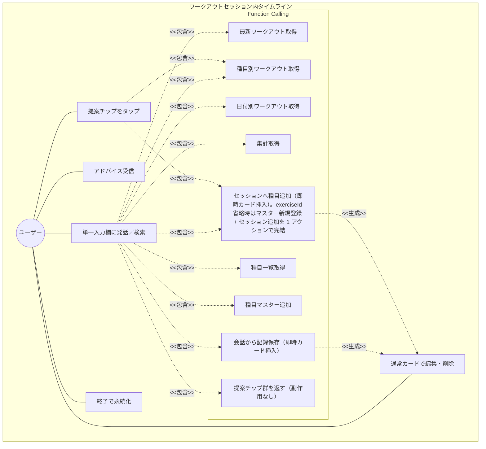

# AIチャット × Function Calling 要求仕様書

**親要求:** [index.md](../index.md) - REQ_005

**注:** 旧 UX（独立 AI チャット画面 + ConfirmationBubble + `addExerciseAndLog` 等）からタイムライン UX への段階的移行は完了済み（旧ロードマップ `timeline-migration.md` は削除）。

## 概要

Gemini API を用いた対話インターフェースを、独立したチャット画面ではなく **ワークアウトセッション内のタイムライン UX** として提供する。種目カード（ExerciseCard）と AI メッセージ（ChatMessage）が時系列で同一スクロール領域に並び、ユーザーは単一の入力欄から自然言語コマンド・種目検索・AI への質問をすべて行う。AI は Function Calling で文脈を参照する。書き込み操作は **手入力と同様にセッションへ通常の ExerciseCard を即時挿入** する。承認/破棄カードは設けず、編集・削除は通常カードの既存 UI で行う。永続化は「終了」時のみで、それまでのレビュー + 編集 + 終了が確認ゲートとなる（REQ_008 / B-002）。

挿入後の編集は通常カードと同一 UI（REQ_008 / FR_013）、種目名のみの追加は recording 空カード（FR_015）、Active Session Context Injection（FR_014）は従来どおり。未登録種目の 1 アクション統合は `addExerciseToSession` の `exerciseId` 省略呼び出しで実現する。

チャット履歴はワークアウトセッションのライフサイクルに同期し、セッションがアクティブな間のみリロード復元され、終了で破棄される（B-001 の不要データ残留防止と「セッション中のリロード耐性」を両立）。

---

## 1. ユースケース図



---

## 2. 要求図（SysML Requirements Diagram）

```mermaid
requirementDiagram
    requirement AIChatCoaching {
        id: REQ_005
        text: "ワークアウトセッション内タイムラインで AI コーチングを提供する"
        risk: high
        verifymethod: demonstration
    }

    functionalRequirement ChatConversation {
        id: FR_011
        text: "Gemini APIを用いたチャット会話"
        risk: high
        verifymethod: test
    }

    functionalRequirement FunctionCalling {
        id: FR_012
        text: "AIが会話の文脈から必要なツールを自律的に呼び出す"
        risk: high
        verifymethod: test
    }

    functionalRequirement ToolGetRecentWorkouts {
        id: FR_012_01
        text: "最新n件のワークアウトを取得するツール"
        risk: medium
        verifymethod: test
    }

    functionalRequirement ToolGetByExercise {
        id: FR_012_02
        text: "種目名で部分一致絞り込みするツール"
        risk: medium
        verifymethod: test
    }

    functionalRequirement ToolGetByDate {
        id: FR_012_03
        text: "日付指定でワークアウトを取得するツール"
        risk: medium
        verifymethod: test
    }

    functionalRequirement ToolGetSummary {
        id: FR_012_04
        text: "週・月単位のワークアウト集計ツール"
        risk: medium
        verifymethod: test
    }

    functionalRequirement ToolSaveWorkout {
        id: FR_012_05
        text: "会話から過去日付のワークアウト記録を保存するツール（セッションへ通常カードとして即時挿入し、ユーザーは通常カードで編集できる）"
        risk: high
        verifymethod: test
    }

    functionalRequirement ToolGetExercises {
        id: FR_012_06
        text: "登録済み種目一覧を取得するツール"
        risk: low
        verifymethod: test
    }

    functionalRequirement ToolAddExercise {
        id: FR_012_07
        text: "種目マスターに新規追加するツール（記録は始めない。ユーザーが明示的にマスター登録のみを希望した場合に呼ぶ）"
        risk: low
        verifymethod: test
    }

    functionalRequirement ToolAddExerciseToSession {
        id: FR_012_08
        text: "アクティブセッションに種目（任意でセット群付き）を追加するツール（手入力と同様に通常カードを即時挿入。実値セットありは完了セット入りの idle カード、値なし/プレースホルダのみは recording の空カード）"
        risk: high
        verifymethod: test
    }

    functionalRequirement ToolProposeAction {
        id: FR_012_09
        text: "副作用なしの提案チップ群を返すツール（kind = start-exercise / ask-followup / show-history）。テキスト返答と併せて assistant メッセージに actions を付与し、ユーザー側のタップで初めて write/read tool が実行される"
        risk: medium
        verifymethod: test
    }


    requirement AIWriteReviewable {
        id: REQ_008
        text: "AI の書き込みは手入力と同様にセッションへ通常カードを即時挿入する。承認/破棄カードは設けず、ユーザーは通常カードの既存 UI で編集・削除でき、永続化は endSession 時のみ。AI がレビュー機会なく履歴へ直接永続化するパスは作らない"
        risk: high
        verifymethod: test
    }

    functionalRequirement InlineSetEditing {
        id: FR_013
        text: "saveWorkout / addExerciseToSession(sets付き) で挿入された通常カードは、トレーニング画面と同一の PendingSetRow / CompletedSetRow による値編集・追加・削除を提供する。実施済みセット（reps>0。自重は weight=0 可）は完了セットとして表示し、reps=0 のセットは作らず recording の空カード（最初のセット入力待ち）とする"
        risk: high
        verifymethod: test
    }

    functionalRequirement ActiveSessionContextInjection {
        id: FR_014
        text: "ワークアウトセッションがアクティブな場合、AI のシステムインストラクションに進行中セッションの状態（開始時刻・各種目の最終セットおよび直近 3 セット・現在入力中の pendingSet）を注入する。トークン圧迫を避けるため要約形式とする"
        risk: medium
        verifymethod: test
    }

    functionalRequirement ExerciseOnlyPlaceholderProposal {
        id: FR_015
        text: "ユーザーが具体値（kg/回数）を伴わずに種目名のみを言及した場合も、AI は placeholder sets [{weight:0, reps:0}] 付きで書き込みツールを呼び出す。挿入側は reps=0 のセットを完了セットにせず、手入力と同じ recording 状態の空カード（最初のセット入力待ち）として即時挿入する。セッションアクティブ時は addExerciseToSession（未登録種目は exerciseId 省略でマスター追加と同時に挿入）、非アクティブ時は saveWorkout(date=今日) を使う"
        risk: medium
        verifymethod: test
    }

    functionalRequirement ChatLifecycleSync {
        id: FR_033
        text: "チャット履歴をワークアウトセッションのライフサイクルに同期させる。アクティブ中のみ localStorage に永続化し、startSession / endSession で履歴をクリアする"
        risk: medium
        verifymethod: test
    }

    functionalRequirement TimelineIntegration {
        id: FR_034
        text: "ExerciseCard と ChatMessage を時系列で同一スクロール領域に統合し、recording 状態のカードは画面上部に sticky で固定する"
        risk: high
        verifymethod: test
    }

    functionalRequirement UnifiedInput {
        id: FR_035
        text: "セッション中の唯一の入力欄が、自然言語コマンド・種目検索・AI への質問を兼ねる"
        risk: medium
        verifymethod: test
    }

    functionalRequirement SessionGate {
        id: FR_036
        text: "セッション非アクティブ時、saveWorkout と addExerciseToSession は SESSION_NOT_ACTIVE を返してユーザーにセッション開始を促す（B-002 の補強）。addExercise は対象外"
        risk: high
        verifymethod: test
    }

    functionalRequirement ProposedActionMode {
        id: FR_037
        text: "ユーザーが種目を未決定のまま選択肢を求めた場合（例: 「何やろう」「胸の日」「メニュー提案して」）、AI は proposeAction ツールを呼び、テキスト + 提案チップ 1〜5 個を返す。副作用ゼロ（カードは作らない）。同一メッセージ内のチップは 1 個タップで他もすべて disabled になる"
        risk: medium
        verifymethod: test
    }

    functionalRequirement ProposalChipDispatch {
        id: FR_038
        text: "提案チップの kind 3 種（start-exercise / ask-followup / show-history）ごとに分岐実行する。start-exercise はクライアントで直接 addExerciseToSession を呼び通常カードを即時生成、show-history は直接 read tool を呼び結果を assistant メッセージ化、ask-followup は payload.prompt を擬似発話として AI に再投入する"
        risk: medium
        verifymethod: test
    }

    AIChatCoaching - contains -> ChatConversation
    AIChatCoaching - contains -> FunctionCalling
    AIChatCoaching - contains -> AIWriteReviewable
    AIChatCoaching - contains -> InlineSetEditing
    AIChatCoaching - contains -> ActiveSessionContextInjection
    AIChatCoaching - contains -> ExerciseOnlyPlaceholderProposal
    AIChatCoaching - contains -> ChatLifecycleSync
    AIChatCoaching - contains -> TimelineIntegration
    AIChatCoaching - contains -> UnifiedInput
    AIChatCoaching - contains -> SessionGate
    AIChatCoaching - contains -> ProposedActionMode
    AIChatCoaching - contains -> ProposalChipDispatch
    FunctionCalling - contains -> ToolGetRecentWorkouts
    FunctionCalling - contains -> ToolGetByExercise
    FunctionCalling - contains -> ToolGetByDate
    FunctionCalling - contains -> ToolGetSummary
    FunctionCalling - contains -> ToolSaveWorkout
    FunctionCalling - contains -> ToolGetExercises
    FunctionCalling - contains -> ToolAddExercise
    FunctionCalling - contains -> ToolAddExerciseToSession
    FunctionCalling - contains -> ToolProposeAction
    ProposedActionMode - deriveReqt -> ToolProposeAction
    ProposalChipDispatch - deriveReqt -> ToolAddExerciseToSession
    ProposalChipDispatch - deriveReqt -> ToolGetByExercise
```

---

## 3. 機能要求の詳細

### FR_011: AIチャット会話

Gemini API を用いた対話を、ワークアウトセッション内のタイムラインで提供する。ユーザーの BYOK API キーで Gemini API に接続する。

**チャットバブル UI スペック（タイムライン内表示）:**

| バブル種別 | 配置 | 背景 | 角丸 | max-width |
|:-----------|:-----|:-----|:-----|:----------|
| ユーザーメッセージ | 右寄せ | `bg-gym-black text-gym-white` | `rounded-[18px] rounded-br-[4px]` | 75% |
| AI 応答（読み取り操作後・テキスト報告） | 左寄せ | `bg-gym-white border-gym-zinc-100 shadow-soft` | `rounded-[18px] rounded-bl-[4px]` | 88% |

- AI メッセージにアバターアイコンは表示しない
- 「AI 確認待ち」種別のチャットバブルは廃止する。AI の書き込みは手入力と同様に **通常カードを即時挿入** し、確認は「セッション全体のレビュー + 終了」に集約する（REQ_008）
- 入力バーはタイムラインの下端に固定（FR_035）

**検証方法:** テストによる検証

### FR_012: Function Calling

AI が会話の文脈を解析し、必要に応じて以下のツールを自律的に呼び出す。

**含まれるツール:**

| ツール | 説明 | 操作種別 |
|--------|------|----------|
| 最新ワークアウト取得 | 最新 n 件のワークアウトを取得 | 読み取り |
| 種目別ワークアウト取得 | 種目名で部分一致絞り込み | 読み取り |
| 日付別ワークアウト取得 | 日付指定で取得 | 読み取り |
| ワークアウト集計 | 週・月単位の集計 | 読み取り |
| ワークアウト保存 | 過去日付の記録を会話から保存 | 書き込み（通常カードを即時挿入） |
| 種目一覧取得 | 登録済み種目一覧を取得 | 読み取り |
| 種目追加 | 種目マスターに追加（記録は始めない、純粋な登録のみ） | 書き込み（カードは作らずチャット応答のみ） |
| セッションへの種目追加 | アクティブセッションに種目（任意でセット群付き）を追加 | 書き込み（通常カードを即時挿入） |
| 種目追加 + 記録開始 | 未登録種目をマスター追加し、セッションに最初のセット記録待ちの空カードを即時挿入 | 書き込み（通常カードを即時挿入） |
| 提案アクション | 副作用なしの提案チップ群を返す（FR_037 / FR_038） | 提案（副作用なし、ユーザータップで初めて write/read 発火） |

セッション非アクティブ時、`saveWorkout` と `addExerciseToSession` は `SESSION_NOT_ACTIVE` を返す（FR_036）。`addExercise` と `proposeAction` は対象外。

**検証方法:** テストによる検証

### REQ_008: AI 書き込みのレビュー可能性（即時カード挿入）

AI が書き込みツール（`saveWorkout` / `addExerciseToSession`）を呼び出した場合、対応する内容を **手入力と同様の通常 ExerciseCard** としてセッションへ即時挿入する。承認/破棄カードは設けない。ユーザーは通常カードの既存 UI でいつでも編集・削除でき、永続化（`WorkoutRepository.save`）は `endSession` 時のみ行われる。

**挙動仕様:**

- 挿入されるカードは手入力で追加したカードと区別しない（`origin` フィールドや「AI 提案」バッジは持たない）
- 実施済みセット（`reps > 0`。自重種目の `weight = 0` は許容）を含むアクションは、それらを **完了セット** とした idle カードとして挿入する
- `reps = 0` のセットしか無いアクション（プレースホルダ `{0,0}` や `reps` 未入力）は、完了セットを作らず **recording 状態の空カード**（最初のセット入力待ち、`pendingSet = {0,0}`）として挿入する
- `addExercise`（種目マスター登録のみ）はカードを作らず、チャット応答のみ返す
- 種目の値編集・セット追加削除・種目削除・並べ替えは、トレーニング画面の通常カードと同一の UI で行う

**例（"ベンチ 60kg 10回 3セットで追加" → 手入力と同じ通常カードが即時挿入される）:**

```
┌─ Bench Press ────────────────────┐
│ [1] 60 kg × 10 回                 │
│ [2] 60 kg × 10 回                 │
│ [3] 60 kg × 10 回                 │
│     [+ セットを追加]              │
└─────────────────────────────────┘
```

種目名のみ（"ダンベルプレスやる"）や未登録種目（"ラットプルダウンやる"、`exerciseId` 省略でマスター登録も同時）の場合は、completedSet を持たない recording 状態の空カード（`pendingSet = {0,0}`）が挿入され、手入力と同じく 1 セット目から入力する。

**理由:**

- AI 書き込みはセッション draft への追加にすぎず、永続化は `endSession` 時のみ。per-write 確認カードは「確認画面」にすぎず、手入力より速くも安全でもなかった（B-002 改定の経緯）
- 手入力と挙動を統一することで「セット詳細の表示・編集は通常 ExerciseCard が単一の責任を持つ」という Single Source of UI を保つ
- モーダル/シートを使わないことで、Modeless かつ親指リーチを維持する（T-003）

**検証方法:** テストによる検証

### FR_012_05: ToolSaveWorkout（過去日付）

過去日付の記録（セッションが既に終了している、または今日以外の日付）を会話から作成するツール。セッションへ通常カードを即時挿入し、編集は通常カードの UI で行う（FR_013）。

セッションがアクティブな場合は `addExerciseToSession` を優先する（FR_014）。未登録種目の場合は `exerciseId` を省略して呼び出すことで、マスター追加とセッション追加を 1 アクションで完結させる。

**検証方法:** テストによる検証

### FR_012_07: ToolAddExercise（種目マスター純粋追加）

種目マスターに種目名を登録する（記録は始めない）。カードは作らずチャット応答のみを返し、「ユーザーが明示的にマスター登録だけ希望した」場合のみ呼ばれる。FR_015 の placeholder 提案フローでは使わない（未登録種目→記録開始は `addExerciseToSession` の `exerciseId` 省略呼び出しで 1 アクション化）。

**検証方法:** テストによる検証

### FR_012_08: ToolAddExerciseToSession

アクティブセッションに種目（任意でセット群付き）を追加する。挿入されるカードは手入力と同じ通常 ExerciseCard で、セットの reps>0/reps=0 によるカード状態は REQ_008 に従う。

**重複ガード:**

- 解決済み `exerciseId` が現在のアクティブセッションの `draftExercises` に既存の場合、`EXERCISE_ALREADY_IN_SESSION` を返してセッションを変更しない（防御線）
- AI には system instruction で「既存セッションに同じ種目がある状態で値の助言を求められた場合はツールを呼ばずテキストで重量・回数を答える」と指示する
- 重複検出キーは解決後の `exerciseId`。`exerciseName` の表記揺れは検出しない
- エラー時はチャットに「その種目は既にセッションに追加されています。」のヒント文言を表示する

**検証方法:** テストによる検証

### FR_013: 即時挿入カードのセット編集（通常カード UI）

AI 書き込みで挿入されたカードは専用の編集フォームを持たず、トレーニング画面の通常 ExerciseCard と同一の UI でセットを編集する（値編集・追加・削除・種目削除・並べ替え。詳細は [workout/index.md](../workout/index.md)）。reps>0/reps=0 によるカード状態と `endSession` 時のみ永続化される点は REQ_008 に従う。

per-write 確認カード（旧 `origin: 'ai-suggested'` バリアント）を廃止した経緯は [ai-chat.md](../../adr/ai-chat.md) を参照。

**検証方法:** テストによる検証

### FR_014: アクティブセッション文脈の AI 注入

ワークアウトセッションがアクティブな場合、AI のシステムインストラクションに進行中セッションの要約を注入する。

**注入内容:**

- セッション開始時刻
- 各 draft 種目について:
  - 種目名
  - 完了済みセット数
  - **直近 3 セット** の `重量kg × 回数回` 列挙
  - pendingSet が dirty な場合: 「現在 N セット目入力中: WkgxR回」

**注入条件:**

- `useWorkoutSessionStore.getState().isActive === true` のとき
- 非アクティブの場合は注入しない（既存の SYSTEM_INSTRUCTION のまま）

**AI への指示追加:**

- セッションがアクティブな場合は `saveWorkout`（過去日付向け）ではなく `addExerciseToSession`（sets 付き、未登録種目は `exerciseId` 省略）を優先する
- ユーザーが具体的な重量・回数を伝えたらそのまま記録として返す（ユーザーは挿入後の通常カードで編集できる）
- ユーザーが具体値を伴わずに種目名のみを述べた場合は FR_015 のフローを適用する
- 進行中セッション情報があるときは、それを踏まえて「前セットからの増減」を 1 行で提案する

**検証方法:** テストによる検証

### FR_015: 種目名のみ入力時の placeholder 提案フロー

ユーザーが具体値（kg/回数）を伴わずに **種目を 1 つに断定して** 述べた場合（例:「胸の日でダンベルプレスやる」「ベンチプレス追加して」）、AI は **必ず** 書き込みツールを呼び出して通常カードを即時挿入する。テキストのみで聞き返してカードを出さない振る舞いは禁止。

**「断定」と「未決定」の境界:**

- 断定（本 FR の対象）: 種目名 1 個を明示的に挙げ、「やる／追加して／始める」と発話している
- 未決定（FR_037 の Proposed フローへ振り分け）: 「何やろう」「胸の日」（部位名のみ）「メニュー提案して」「おすすめは?」のように選択肢を求めている発話。これらに対しては書き込みツールを呼ばず `proposeAction` を呼ぶ

**フロー:**

1. **種目マスター確認**: 入力された種目名が登録済みかを判断する。不明な場合は `getExercises` で確認する
2. **未登録種目を始める** → `addExerciseToSession({ exerciseName, sets: [{ weight: 0, reps: 0 }] })`（`exerciseId` 省略）を 1 回呼び、種目マスター追加とセッションへの recording 空カード挿入を 1 アクションで完結させる
3. **登録済み + セッション分岐**:
   - **アクティブ** → `addExerciseToSession({ exerciseId, exerciseName, sets: [{ weight: 0, reps: 0 }] })`
   - **非アクティブ** → `saveWorkout({ date: 今日, exercises: [{ exerciseName, sets: [{ weight: 0, reps: 0 }] }] })`
4. **テキスト応答**: ツール呼び出しと併せて短い励まし＋値入力の促し（例:「ナイス💪 重量と回数を入力してください」）を返す

挿入後は `sets:[{0,0}]` placeholder が recording 状態の空カードになる（REQ_008）。

**禁止事項:**

- 種目名が決まったのにテキストのみで応答すること（カードが出ないと UX が壊れる）
- placeholder の値を 0 以外（例: 50kg/10 等の架空値）で埋めること（事実誤認の元）
- 既にアクティブセッションの `draftExercises` に同じ種目がある状態で「何キロがいいかな」「重さ提案して」などの **値の助言** に対して `addExerciseToSession` を再呼び出しすること（重複カードが生成される。代わりにテキスト応答で前セットからの増減を提案する）
- **未決定発話**（「何やろう」「メニュー」「○○の日」など）に対して書き込みツールを呼び出すこと（FR_037 の Proposed フローへ振り分ける）

**検証方法:** テストによる検証

### FR_033: チャット履歴のセッション同期

- セッションが **アクティブな間のみ** チャット履歴を localStorage に永続化する（リロード復元のため）
- セッション非アクティブ時はチャット履歴を **永続化しない**（B-001 不要データ残留防止）
- `startSession` と `endSession`（FR_001）でチャット履歴をクリアする
- 過去のセッションに紐づいた対話履歴のアーカイブ閲覧はスコープ外（将来要件）

**検証方法:** テストによる検証

### FR_034: タイムライン統合

ワークアウトセッション中、ExerciseCard と ChatMessage を **同一スクロール領域内に時系列で表示** する。

- 種目追加・セット完了・AI メッセージ・AI による種目カード挿入などの出来事が時系列順に並ぶ
- `recording` 状態の ExerciseCard は画面上部に **sticky 固定** され、スクロール中も入力 UI が常時可視
- 同時に `recording` になれる種目は 1 つ（[workout/index.md](../workout/index.md) FR_030 を継承）
- **Proposed メッセージ（FR_037）** はカードを作らず `actions` 付き ChatMessage として時系列に並び、ChatBubble の通常スタイル内に提案チップ群を描画する。タイムラインの時系列順序や sticky 挙動には影響しない

**検証方法:** テストによる検証

### FR_035: 単一入力欄

セッション中の唯一の入力欄が、自然言語コマンド・種目検索・AI への質問を兼ねる。

- 自然言語入力（例: 「今日のスクワットの調子はどう?」）→ AI 応答
- 種目名の入力（例: 「ベンチ」）→ 候補チップを popover で提示し、タップで種目を追加
- 数値・記録の指示（例: 「ベンチ 60kg×10×3 で記録」）→ AI が `addExerciseToSession` または `saveWorkout` を呼び出し、通常カードを即時挿入

旧 ExerciseSearchField は廃止し、検索機能をこの入力欄に統合する。

**検証方法:** テストによる検証

### FR_036: セッションゲート（書き込みツール）

セッションが非アクティブな状態で `saveWorkout` または `addExerciseToSession` が呼ばれた場合、ツール実行は `SESSION_NOT_ACTIVE` を返し、AI はユーザーに「先にセッションを開始してください」と案内する。

- セッション開始導線は [workout/index.md](../workout/index.md) の FRAME1 に従う
- UI 上はタイムライン入力欄が非アクティブ時には無効化されるため、通常はこのガードに到達しない（防御線）
- **対象外ツール**:
  - `addExercise`（種目マスター登録）はセッションと無関係なため対象外
- **過去日付保存（将来要件）**: 「日付指定で過去のワークアウトを補完保存する」UX は将来要件として残す。本 PRD では現状 `saveWorkout` も `isActive=false` で一律 `SESSION_NOT_ACTIVE` を返す。詳細は [ai-chat ADR](../../adr/ai-chat.md)「セッション外 write tool」項

**検証方法:** テストによる検証

### FR_037: Proposed メッセージモード（未決定発話への提案チップ）

ユーザーが種目を未決定のまま選択肢を求めた場合、AI は `proposeAction` ツールを呼び、テキスト本文 + 提案チップ群（1〜5 個、推奨は 2〜4 個）を含む **Proposed メッセージ** を返す。カードは作らず、副作用ゼロ。

**トリガーする発話例:**

- 「何やろう」「次の種目どうしよ」
- 「胸の日」「背中の日」（部位名のみで種目未指定）
- 「メニュー提案して」「おすすめは?」「候補ほしい」
- 「軽めの日のメニュー提案して」「フォーム重視で何かない?」

**Proposed メッセージの仕様:**

- ChatBubble の通常スタイル（assistant 左寄せ、白背景）の本文として AI の rationale テキストを表示
- 本文下に提案チップ群を `flex flex-wrap gap-2` で配置
- チップは raw `<button>` + gym-* トークン、`min-h-[44px]` でタップターゲットを確保
- 同一 Proposed メッセージ内のチップは **1 個タップで他もすべて disabled**（誤連打防止）。消費済みチップは `disabled` + Phosphor `Check` アイコン
- リロード後も未消費チップは機能する（chatStore の永続化対象）

**Conversational / Committed との境界:**

- Conversational（テキストのみ）: 質問・雑談・読み取り要求（「最近どう?」「胸の日いつだっけ?」）
- Proposed（本 FR）: 上記トリガー例
- Committed（FR_015）: 種目名 1 個の断定発話、または具体値（kg/回数/セット数）を含む発話

判定優先ルール:

1. 具体的な重量/回数/セット数が入力に含まれる → **無条件で Committed**（上級者の即記録体験を守る）
2. 種目名 1 個のみの断定発話 → Committed（FR_015）
3. 上記の未決定発話パターン → Proposed
4. それ以外 → Conversational

**検証方法:** テストによる検証

### FR_038: 提案チップのアクション実行（kind 別ハイブリッド導線）

提案チップは 3 種類の kind を持ち、それぞれ異なる経路で実行される。

| kind | 経路 | 振る舞い |
|------|------|----------|
| `start-exercise` | クライアントで直接 `executeWriteTool('addExerciseToSession', { exerciseName, sets: [{ weight: 0, reps: 0 }] })` を実行 | AI を介さず即座に通常カード（recording 空カード）を挿入。FR_013 / FR_015 のフローに合流 |
| `show-history` | クライアントで直接 `executeReadTool('getWorkoutsByExercise', { exerciseName })` を実行 | 結果テキストを assistant メッセージとして追加。AI を介さない |
| `ask-followup` | `payload.prompt`（無ければ `label`）を擬似発話として再投入 | user メッセージとして表示後、AI に再判断させる |

**設計の根拠:**

- `start-exercise` / `show-history` は chip タップ時点でユーザーの「決定」が確定済みのため、AI 再判断は遅延・揺らぎ・別 tool への迷走を招く。決定論的に実行する
- `ask-followup` は会話継続が本質。AI に再判断させるのが自然

**エラーハンドリング:**

- chip 経由の `executeWriteTool` が `SESSION_NOT_ACTIVE` / `EXERCISE_ALREADY_IN_SESSION` を返した場合、対応するヒント文言を assistant メッセージとして表示
- chip 経由の `executeReadTool` が失敗した場合、エラー文言を assistant メッセージとして表示
- いずれの場合も `consumedActionId` は更新され、同一チップの再タップは no-op

**検証方法:** テストによる検証

---

## 4. 画面レイアウト

タイムライン UX のレイアウトは [workout/index.md](../workout/index.md) FRAME2 を参照。AI チャットは独立した FRAME を持たず、FRAME2 内のタイムラインに統合される。

旧 FRAME4（独立 AI チャット画面）は撤去済み。AI 対話はすべて FRAME2 のタイムライン上で完結する（詳細は [navigation.md](../navigation.md) FR_020 を参照）。

---

## 5. スコープ外

- 過去ワークアウトに紐づくチャット履歴のアーカイブ閲覧（将来要件）
- 音声入力・読み上げ
- 複数 AI モデルの切り替え（[ai-chat.md](../../adr/ai-chat.md) で `gemini-flash-latest` 固定の方針）
- AI 挿入カード上での種目名変更（種目追加削除・並べ替えは通常カードと同一 UI で実施）
