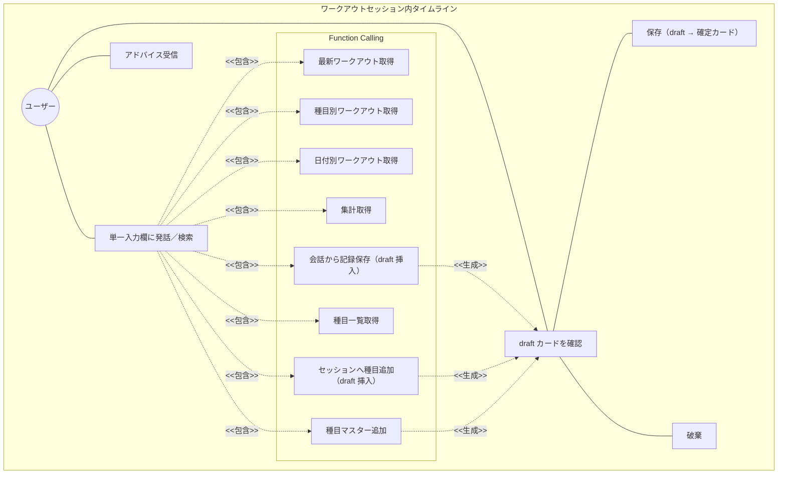

# AIチャット × Function Calling 要求仕様書

**親要求:** [index.md](../index.md) - REQ_005

**関連:** [timeline-migration.md](timeline-migration.md)（旧 UX → タイムライン UX への段階的移行ロードマップ。移行完了後に削除可）

## 概要

Gemini APIを用いた対話インターフェースを、独立したチャット画面ではなく **ワークアウトセッション内のタイムライン UX** として提供する。種目カード（ExerciseCard）と AI メッセージ（ChatMessage）が時系列で同一スクロール領域に並び、ユーザーは単一の入力欄から自然言語コマンド・種目検索・AI への質問をすべて行う。AI は Function Calling で文脈を参照し、書き込み操作はタイムラインに **draft カードを直接挿入** する形でユーザー確認を求める（REQ_008）。

チャット履歴はワークアウトセッションのライフサイクルに同期し、セッションがアクティブな間のみリロード復元され、終了で破棄される（B-001 の不要データ残留防止と「セッション中のリロード耐性」を両立）。

---

## 1. ユースケース図



---

## 2. 要求図（SysML Requirements Diagram）

```mermaid
requirementDiagram
    requirement AIChatCoaching {
        id: REQ_005
        text: "ワークアウトセッション内タイムラインで AI コーチングを提供する"
        risk: high
        verifymethod: demonstration
    }

    functionalRequirement ChatConversation {
        id: FR_011
        text: "Gemini APIを用いたチャット会話"
        risk: high
        verifymethod: test
    }

    functionalRequirement FunctionCalling {
        id: FR_012
        text: "AIが会話の文脈から必要なツールを自律的に呼び出す"
        risk: high
        verifymethod: test
    }

    functionalRequirement ToolGetRecentWorkouts {
        id: FR_012_01
        text: "最新n件のワークアウトを取得するツール"
        risk: medium
        verifymethod: test
    }

    functionalRequirement ToolGetByExercise {
        id: FR_012_02
        text: "種目名で部分一致絞り込みするツール"
        risk: medium
        verifymethod: test
    }

    functionalRequirement ToolGetByDate {
        id: FR_012_03
        text: "日付指定でワークアウトを取得するツール"
        risk: medium
        verifymethod: test
    }

    functionalRequirement ToolGetSummary {
        id: FR_012_04
        text: "週・月単位のワークアウト集計ツール"
        risk: medium
        verifymethod: test
    }

    functionalRequirement ToolSaveWorkout {
        id: FR_012_05
        text: "会話からワークアウト記録を保存するツール（draft カードとして挿入し、ユーザー承認で確定）"
        risk: high
        verifymethod: test
    }

    functionalRequirement ToolGetExercises {
        id: FR_012_06
        text: "登録済み種目一覧を取得するツール"
        risk: low
        verifymethod: test
    }

    functionalRequirement ToolAddExercise {
        id: FR_012_07
        text: "種目マスターに新規追加するツール（ユーザー確認必須）"
        risk: low
        verifymethod: test
    }

    functionalRequirement ToolAddExerciseToSession {
        id: FR_012_08
        text: "アクティブセッションに種目を追加するツール（draft カードとして挿入し、ユーザー承認で確定）"
        risk: high
        verifymethod: test
    }

    functionalRequirement ChatLifecycleSync {
        id: FR_033
        text: "チャット履歴をワークアウトセッションのライフサイクルに同期させる"
        risk: medium
        verifymethod: test
    }

    functionalRequirement TimelineIntegration {
        id: FR_034
        text: "ExerciseCard と ChatMessage を時系列で同一スクロール領域に統合し、recording 状態のカードは画面上部に sticky で固定する"
        risk: high
        verifymethod: test
    }

    functionalRequirement UnifiedInput {
        id: FR_035
        text: "セッション中の唯一の入力欄が、自然言語コマンド・種目検索・AI への質問を兼ねる"
        risk: medium
        verifymethod: test
    }

    functionalRequirement SessionGate {
        id: FR_036
        text: "セッション非アクティブ時、書き込みツールは SESSION_NOT_ACTIVE を返してユーザーにセッション開始を促す"
        risk: high
        verifymethod: test
    }

    requirement AIWriteConfirmation {
        id: REQ_008
        text: "AI の書き込み操作は draft カードをタイムラインに挿入することでユーザー確認を求める"
        risk: high
        verifymethod: test
    }

    AIChatCoaching - contains -> ChatConversation
    AIChatCoaching - contains -> FunctionCalling
    AIChatCoaching - contains -> AIWriteConfirmation
    AIChatCoaching - contains -> ChatLifecycleSync
    AIChatCoaching - contains -> TimelineIntegration
    AIChatCoaching - contains -> UnifiedInput
    AIChatCoaching - contains -> SessionGate
    FunctionCalling - contains -> ToolGetRecentWorkouts
    FunctionCalling - contains -> ToolGetByExercise
    FunctionCalling - contains -> ToolGetByDate
    FunctionCalling - contains -> ToolGetSummary
    FunctionCalling - contains -> ToolSaveWorkout
    FunctionCalling - contains -> ToolGetExercises
    FunctionCalling - contains -> ToolAddExercise
    FunctionCalling - contains -> ToolAddExerciseToSession
    AIWriteConfirmation - derives -> ToolSaveWorkout
    AIWriteConfirmation - derives -> ToolAddExercise
    AIWriteConfirmation - derives -> ToolAddExerciseToSession
    SessionGate - derives -> AIWriteConfirmation
    TimelineIntegration - traces -> WorkoutManagement
    UnifiedInput - traces -> WorkoutManagement
```

---

## 3. 機能要求の詳細

### FR_011: AIチャット会話

Gemini APIを用いた対話を、ワークアウトセッション内のタイムラインで提供する。ユーザーのBYOK APIキーで Gemini API に接続する。

**チャットバブル UI スペック（タイムライン内表示）:**

| バブル種別 | 配置 | 背景 | 角丸 | max-width |
|:-----------|:-----|:-----|:-----|:----------|
| ユーザーメッセージ | 右寄せ | `bg-gym-black text-gym-white` | `rounded-[18px] rounded-br-[4px]` | 75% |
| AI 応答（読み取り操作後） | 左寄せ | `bg-gym-white border-gym-zinc-100 shadow-soft` | `rounded-[18px] rounded-bl-[4px]` | 88% |

- AI メッセージにアバターアイコンは表示しない
- 「AI 確認待ち」種別のチャットバブルは廃止し、書き込み確認は draft カード（REQ_008）に集約する
- 入力バーはタイムラインの下端に固定（FR_035）

**検証方法:** テストによる検証

### FR_012: Function Calling

AIが会話の文脈を解析し、必要に応じて以下のツールを自律的に呼び出す。

| ツール | 説明 | 操作種別 |
|--------|------|----------|
| 最新ワークアウト取得 | 最新n件のワークアウトを取得 | 読み取り |
| 種目別ワークアウト取得 | 種目名で部分一致絞り込み | 読み取り |
| 日付別ワークアウト取得 | 日付指定で取得 | 読み取り |
| ワークアウト集計 | 週・月単位の集計 | 読み取り |
| ワークアウト保存 | 会話から記録を保存 | 書き込み（draft カードで確認） |
| 種目一覧取得 | 登録済み種目一覧を取得 | 読み取り |
| 種目追加 | 種目マスターに追加 | 書き込み（要確認） |
| セッションへの種目追加 | アクティブセッションに種目を追加 | 書き込み（draft カードで確認） |

**検証方法:** テストによる検証

### FR_033: チャット履歴のセッション同期

- セッションが **アクティブな間のみ** チャット履歴を localStorage に永続化する（リロード復元のため）
- セッション非アクティブ時はチャット履歴を **永続化しない**（B-001 不要データ残留防止）
- `endSession`（FR_001）でチャット履歴をクリアする
- 過去のセッションに紐づいた対話履歴のアーカイブ閲覧はスコープ外（将来要件）

**検証方法:** テストによる検証

### FR_034: タイムライン統合

ワークアウトセッション中、ExerciseCard と ChatMessage を **同一スクロール領域内に時系列で表示** する。

- 種目追加・セット完了・AI メッセージ・draft カード提案などの出来事が時系列順に並ぶ
- `recording` 状態の ExerciseCard は画面上部に **sticky 固定** され、スクロール中も入力 UI が常時可視
- 同時に `recording` になれる種目は1つ（[workout/index.md](../workout/index.md) FR_030 を継承）

**検証方法:** テストによる検証

### FR_035: 単一入力欄

セッション中の唯一の入力欄が、自然言語コマンド・種目検索・AI への質問を兼ねる。

- 自然言語入力（例: 「今日のスクワットの調子はどう?」）→ AI 応答
- 種目名の入力（例: 「ベンチ」）→ 候補チップを popover で提示し、タップで種目を追加
- 数値・記録の指示（例: 「ベンチ60kg×10×3で記録」）→ AI が `addExerciseToSession` または `saveWorkout` を呼び出し、draft カードを挿入

旧 ExerciseSearchField は廃止し、検索機能をこの入力欄に統合する。

**検証方法:** テストによる検証

### FR_036: セッションゲート（書き込みツール）

セッションが非アクティブな状態で書き込みツール（`saveWorkout` / `addExerciseToSession` 等）が呼ばれた場合、ツール実行は `SESSION_NOT_ACTIVE` を返し、AI はユーザーに「先にセッションを開始してください」と案内する。

- セッション開始導線は [workout/index.md](../workout/index.md) の FRAME1 に従う
- UI 上はタイムライン入力欄が非アクティブ時には無効化されるため、通常はこのガードに到達しない（防御線）

**検証方法:** テストによる検証

### REQ_008: AI 書き込み操作のユーザー確認（draft カード）

AI が書き込み操作を実行する際、対応する **draft 状態の ExerciseCard** をタイムラインに直接挿入することで確認を求める。承認されるまでデータには反映しない。

**draft カード仕様:**

- ExerciseCard の `origin: 'ai-suggested'` バリアントとして表示（薄色背景 + 「AI 提案」バッジ）
- カード内に「保存」「破棄」のアクションを内蔵する
- 「保存」で manual と同等の確定カードに昇格する
- 「破棄」で draft が消え、AI へ「破棄しました」相当の文脈情報が渡る

**理由:**

- 旧インラインボタン UI（チャットバブル内 [追加する]/[キャンセル]）は、セット詳細をバブル本文と確定後の ExerciseCard で **二重に表示** する DRY 違反を生んでいた
- draft カード直挿は「セット詳細の表示は ExerciseCard が単一の責任を持つ」という原則を満たす
- モーダル/シートを使わないことで、Modeless かつ親指操作を維持する（T-003）

**検証方法:** テストによる検証

---

## 4. 画面レイアウト

タイムライン UX のレイアウトは [workout/index.md](../workout/index.md) FRAME2 を参照。AI チャットは独立した FRAME を持たず、FRAME2 内のタイムラインに統合される。

旧 FRAME4（独立 AI チャット画面）は段階的に撤去される（[navigation.md](../navigation.md) FR_020 の改訂、[timeline-migration.md](timeline-migration.md) Phase 8 を参照）。

---

## 5. スコープ外

- 過去ワークアウトに紐づくチャット履歴のアーカイブ閲覧（将来要件）
- 音声入力・読み上げ
- 複数 AI モデルの切り替え（[ADR](../../adr/ai-chat.md) で `gemini-flash-latest` 固定の方針）
