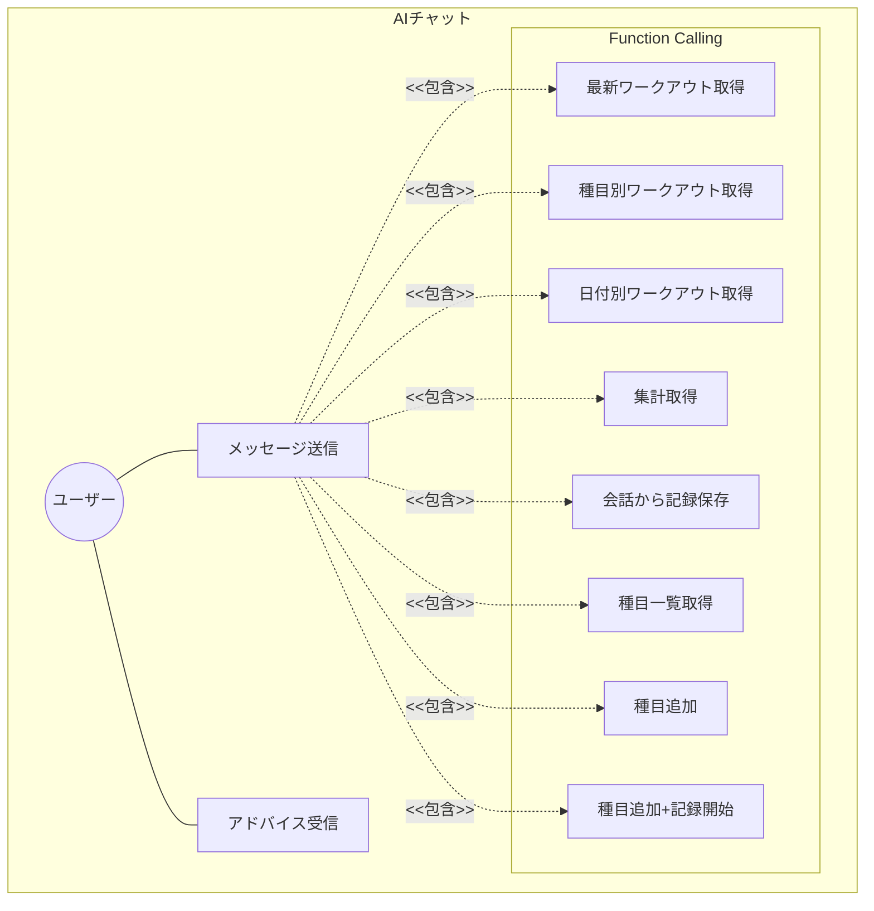

# AIチャット × Function Calling 要求仕様書

**親要求:** [index.md](../index.md) - REQ_005

## 概要

Gemini APIを用いたチャットインターフェースを提供し、AIが会話の文脈からワークアウトデータを参照・操作するFunction Callingツールを自律的に呼び出す。書き込み操作にはユーザー確認を必須とする（REQ_008）。

---

## 1. ユースケース図



---

## 2. 要求図（SysML Requirements Diagram）

```mermaid
requirementDiagram
    requirement AIChatCoaching {
        id: REQ_005
        text: "AIチャットによるコーチング機能"
        risk: high
        verifymethod: demonstration
    }

    functionalRequirement ChatConversation {
        id: FR_011
        text: "Gemini APIを用いたチャット会話"
        risk: high
        verifymethod: test
    }

    functionalRequirement FunctionCalling {
        id: FR_012
        text: "AIが会話の文脈から必要なツールを自律的に呼び出す"
        risk: high
        verifymethod: test
    }

    functionalRequirement ToolGetRecentWorkouts {
        id: FR_012_01
        text: "最新n件のワークアウトを取得するツール"
        risk: medium
        verifymethod: test
    }

    functionalRequirement ToolGetByExercise {
        id: FR_012_02
        text: "種目名で部分一致絞り込みするツール"
        risk: medium
        verifymethod: test
    }

    functionalRequirement ToolGetByDate {
        id: FR_012_03
        text: "日付指定でワークアウトを取得するツール"
        risk: medium
        verifymethod: test
    }

    functionalRequirement ToolGetSummary {
        id: FR_012_04
        text: "週・月単位のワークアウト集計ツール"
        risk: medium
        verifymethod: test
    }

    functionalRequirement ToolSaveWorkout {
        id: FR_012_05
        text: "会話からワークアウト記録を保存するツール（ユーザー確認必須）"
        risk: high
        verifymethod: test
    }

    functionalRequirement ToolGetExercises {
        id: FR_012_06
        text: "登録済み種目一覧を取得するツール"
        risk: low
        verifymethod: test
    }

    functionalRequirement ToolAddExercise {
        id: FR_012_07
        text: "種目マスターに新規追加するツール（ユーザー確認必須）"
        risk: low
        verifymethod: test
    }

    functionalRequirement ToolAddExerciseToSession {
        id: FR_012_08
        text: "アクティブセッションに種目（任意でセット群付き）を追加するツール（ユーザー確認必須・編集可能インラインフォーム）"
        risk: high
        verifymethod: test
    }

    functionalRequirement ToolAddExerciseAndLog {
        id: FR_012_09
        text: "未登録種目について、種目マスター追加とアクティブセッションへの追加（必要なら自動開始）と最初のセット記録を 1 回の確認で完結させるツール（ユーザー確認必須・編集可能インラインフォーム）"
        risk: high
        verifymethod: test
    }

    requirement AIWriteConfirmation {
        id: REQ_008
        text: "AIが書き込み操作を実行する前にチャットバブル内のインラインUIでユーザー確認を求める。重量・回数を伴う提案は AI 提案値（実値または空のプレースホルダ）を初期値とする編集可能フォームを表示し、確定時はユーザー編集後の値で実行する。全セットの重量・回数が確定値（>0）でない限り「記録する」は disabled となる"
        risk: high
        verifymethod: test
    }

    functionalRequirement InlineSetEditing {
        id: FR_013
        text: "saveWorkout / addExerciseToSession(sets付き) の確認 UI は、各セットの重量・回数を編集可能な入力行（PendingSetRow を再利用）として描画する。ユーザーは値を変更し、行の追加・削除を行ってから記録できる。値が 0 のセットは空入力＋プレースホルダ（kg/回）で表示し、全セット weight>0 かつ reps>0 でない限り確定不可。種目名・種目並び替え・種目追加削除はチャット側では編集不可"
        risk: high
        verifymethod: test
    }

    functionalRequirement ActiveSessionContextInjection {
        id: FR_014
        text: "ワークアウトセッションがアクティブな場合、AI のシステムインストラクションに進行中セッションの状態（開始時刻・各種目の最終セットおよび直近 3 セット・現在入力中の pendingSet）を注入する。トークン圧迫を避けるため要約形式とする"
        risk: medium
        verifymethod: test
    }

    functionalRequirement ExerciseOnlyPlaceholderProposal {
        id: FR_015
        text: "ユーザーが具体値（kg/回数）を伴わずに種目名のみを言及した場合も、AI は placeholder sets [{weight:0, reps:0}] 付きで書き込みツールを呼び出し、編集可能フォームを提示する。セッションアクティブ時は addExerciseToSession、非アクティブ時は saveWorkout(date=今日) を使う"
        risk: medium
        verifymethod: test
    }

    AIChatCoaching - contains -> ChatConversation
    AIChatCoaching - contains -> FunctionCalling
    AIChatCoaching - contains -> AIWriteConfirmation
    AIChatCoaching - contains -> InlineSetEditing
    AIChatCoaching - contains -> ActiveSessionContextInjection
    AIChatCoaching - contains -> ExerciseOnlyPlaceholderProposal
    FunctionCalling - contains -> ToolGetRecentWorkouts
    FunctionCalling - contains -> ToolGetByExercise
    FunctionCalling - contains -> ToolGetByDate
    FunctionCalling - contains -> ToolGetSummary
    FunctionCalling - contains -> ToolSaveWorkout
    FunctionCalling - contains -> ToolGetExercises
    FunctionCalling - contains -> ToolAddExercise
    FunctionCalling - contains -> ToolAddExerciseToSession
    FunctionCalling - contains -> ToolAddExerciseAndLog
```



---

## 3. 機能要求の詳細

### FR_011: AIチャット会話

Gemini APIを用いたチャットインターフェースを提供する。ユーザーのBYOK APIキーを使ってGemini APIに接続する。

**デザインリファレンス:** [design-system.html](../../design-system.html) FRAME4

**チャットバブルUIスペック:**

| バブル種別 | 配置 | 背景 | 角丸 | max-width |
|:-----------|:-----|:-----|:-----|:----------|
| ユーザーメッセージ | 右寄せ | `bg-black text-white` | `rounded-[18px] rounded-br-[4px]` | 75% |
| AI返答（読み取り操作後） | 左寄せ | `bg-white border-zinc-100 shadow-soft` | `rounded-[18px] rounded-bl-[4px]` | 88% |
| AI確認待ち（書き込み操作） | 左寄せ | `bg-white border-zinc-200 shadow-soft` | `rounded-[18px] rounded-bl-[4px]` | 88% |

- AIメッセージにアバターアイコンは表示しない（幅節約）
- 入力バー: BottomNavの上に固定（`bottom: 96px`）、丸角テキスト入力 + 送信ボタン

**検証方法:** テストによる検証

### FR_012: Function Calling

AIが会話の文脈を解析し、必要に応じて以下のツールを自律的に呼び出す。

**含まれるツール:**

| ツール | 説明 | 操作種別 |
|--------|------|----------|
| 最新ワークアウト取得 | 最新n件のワークアウトを取得 | 読み取り |
| 種目別ワークアウト取得 | 種目名で部分一致絞り込み | 読み取り |
| 日付別ワークアウト取得 | 日付指定で取得 | 読み取り |
| ワークアウト集計 | 週・月単位の集計 | 読み取り |
| ワークアウト保存 | 会話から記録を保存 | 書き込み（要確認・編集フォーム） |
| 種目一覧取得 | 登録済み種目一覧を取得 | 読み取り |
| 種目追加 | 種目マスターに追加（記録は始めない、純粋な登録のみ） | 書き込み（要確認） |
| セッションへの種目追加 | アクティブセッションに種目（任意でセット群付き）を追加 | 書き込み（要確認・sets付きは編集フォーム） |
| 種目追加 + 記録開始 | 未登録種目をマスター追加し、セッション（無ければ自動開始）に最初のセット記録までを 1 回の確認で完結 | 書き込み（要確認・編集フォーム） |

**検証方法:** テストによる検証

### REQ_008: AI書き込み操作のユーザー確認（インラインUI）

AIが書き込み操作（ワークアウト保存・種目追加・セッションへの種目追加）を実行する際、実行前にユーザーに確認を求める。読み取り操作（データ取得・集計）はユーザー確認なしで自律的に実行できる。

**確認UIの表示形式:**

- 確認UIはチャットのメッセージバブル内にインラインで表示する（別モーダルや別ダイアログは使用しない）
- セット情報を含むアクション（`saveWorkout` / `addExerciseToSession`(sets付き)）は **編集可能フォーム** をバブル内に表示し、AI 提案値（実値または空のプレースホルダ）を初期値とする（FR_013 参照）
- セット情報を伴わないアクション（`addExercise` / `addExerciseToSession`(sets無し)）は確認テキスト＋ボタンのみ
- 確定時はユーザーが編集後の値で書き込みを実行する
- 全セット weight>0 かつ reps>0 を満たさない限り「記録する」は disabled となり、不足セルがあるときはヒント文言「重量と回数を入力してください」を表示する
- ユーザーが確認後、AI は結果をチャット内で報告する

**例（セッションへの種目追加・sets無し）:**

```
AI: 「スクワットを今日のセッションに追加しますか？」
    [追加する]  [キャンセル]   ← バブル内インラインボタン
```

**例（セッションへの種目追加・sets付き）:**

```
AI: 「ベンチプレスを以下の内容でセッションに追加しますか？値は調整できます」
    [1] 60 kg × 10 回  [−]
    [2] 60 kg × 10 回  [−]
    [3] 60 kg × 10 回  [−]
        [+ セットを追加]
    [キャンセル]  [記録する]
```

**例（種目名のみ言及・placeholder 提案、FR_015）:**

```
ユーザー:「胸の日でダンベルプレスやる」
AI: 「ナイス💪 ダンベルプレスですね。重量と回数を入力してください」
    [1] _ kg × _ 回  [−]      ← 空入力プレースホルダ
        [+ セットを追加]
    [キャンセル]  [記録する] (disabled)   ← 値が 0 のため
    重量と回数を入力してください    ← ヒント文言
```

**例（未登録種目を始める・FR_015 / addExerciseAndLog）:**

```
ユーザー:「背中の日。ラットプルダウンやる」（マスターに「ラットプルダウン」なし）
AI: 「ナイス💪 ラットプルダウンを追加して始めましょう。重量と回数を入力してください」
    「ラットプルダウン」を種目マスターに追加して、記録を始めますか？
    ラットプルダウン
    [1] _ kg × _ 回  [−]
        [+ セットを追加]
    [キャンセル]  [追加して記録する] (disabled)
    重量と回数を入力してください
```

**インラインボタンUIスペック:**
- キャンセル: `bg-zinc-100 text-black font-semibold rounded-xl h-11`
- 実行（追加する等）: `bg-black text-white font-bold rounded-xl h-11` + アイコン
- 2ボタンを `flex gap-2` で横並び、各 `flex-1`

**検証方法:** テストによる検証

### FR_013: 確認バブル内インライン編集フォーム

セット情報を含む書き込みアクションの確認 UI は、訓練画面の `PendingSetRow` を再利用した編集可能フォームをバブル内に表示する。

**仕様:**

- 種目名は読み取り専用（チャット側で種目変更・追加・削除・並べ替えは行わない）
- 各セット行で重量（kg）・回数（回）を数値入力可能。`PendingSetRow` のキー操作仕様（重量 → 回数の自動フォーカス、Enter で追加）を踏襲
- 値が 0 のセット（AI が placeholder で提案した未確定セット）は **空入力 + プレースホルダ表示**（`kg` / `回`）で描画する。内部状態は 0 のまま保持し、ユーザーの入力値で上書きする
- セット末尾に「+ セットを追加」ボタン、各セット行に削除（−）ボタンを配置
- 「記録する」確定時、AI 提案値ではなくユーザー編集後の `{date, exercises[].sets[]}` を `executeWriteTool` に渡す
- セット数 0 の種目を含めて確定することはできない（最低 1 セット必要、UI で抑止）
- **全セットが weight>0 かつ reps>0 でない限り「記録する」は disabled** となり、不足セルがあるときはボタン下にヒント文言「重量と回数を入力してください」を表示する

**スコープ外:** 種目の追加・削除・並べ替え・種目名変更はトレーニング画面（`/training`）に集約する。チャット側ではセットの値編集と +/− に限定する。

**検証方法:** テストによる検証

### FR_014: アクティブセッション文脈の AI 注入

ワークアウトセッションがアクティブな場合、AI のシステムインストラクションに進行中セッションの要約を注入する。

**注入内容:**

- セッション開始時刻
- 各 draft 種目について:
  - 種目名
  - 完了済みセット数
  - **直近 3 セット** の `重量kg × 回数回` 列挙
  - pendingSet が dirty な場合: 「現在 N セット目入力中: WkgxR回」

**注入条件:**

- `useWorkoutSessionStore.getState().isActive === true` のとき
- 非アクティブの場合は注入しない（既存の SYSTEM_INSTRUCTION のまま）

**AI への指示追加:**

- セッションがアクティブな場合は `saveWorkout` ではなく `addExerciseToSession`(sets 付き) を優先する
- ユーザーが具体的な重量・回数を伝えたらそのまま提案として返す（ユーザーが UI で編集できる）
- ユーザーが具体値を伴わずに種目名のみを述べた場合は FR_015 のフローを適用する
- 進行中セッション情報があるときは、それを踏まえて「前セットからの増減」を 1 行で提案する

**検証方法:** テストによる検証

### FR_015: 種目名のみ入力時の placeholder 提案フロー

ユーザーが具体値（kg/回数）を伴わずに種目名・運動意図を述べた場合（例:「胸の日でダンベルプレスやる」「ベンチプレス追加して」）、AI は **必ず** 書き込みツールを呼び出して編集可能フォームを提示する。テキストのみで聞き返してフォームを出さない振る舞いは禁止。

**フロー:**

1. **種目マスター確認**: 入力された種目名が登録済みかを判断する。不明な場合は `getExercises` で確認する
2. **未登録種目を始める** → `addExerciseAndLog({ name, sets: [{ weight: 0, reps: 0 }] })` を 1 回呼び、種目追加と最初のセット記録を 1 つの確認カードで完結させる（addExercise + addExerciseToSession の 2 段確認は使わない）
3. **登録済み + セッション分岐**:
   - **アクティブ** → `addExerciseToSession({ exerciseId, exerciseName, sets: [{ weight: 0, reps: 0 }] })`
   - **非アクティブ** → `saveWorkout({ date: 今日, exercises: [{ exerciseName, sets: [{ weight: 0, reps: 0 }] }] })`
4. **テキスト応答**: ツール呼び出しと併せて短い励まし＋値入力の促し（例:「ナイス💪 重量と回数を入力してください」）を返す

**ConfirmationBubble での挙動:**

- `sets:[{0,0}]` の placeholder は空入力 + プレースホルダ表示（FR_013）
- 「記録する」は disabled（FR_013 の確定条件を満たさない）
- ユーザーが kg/回数を入力すると enabled になり、編集後の値で `executeWriteTool` が呼ばれる

**禁止事項:**

- 種目名が決まったのにテキストのみで応答すること（フォームが出ないと UX が壊れる）
- placeholder の値を 0 以外（例: 50kg/10 等の架空値）で埋めること（事実誤認の元）

**検証方法:** テストによる検証
