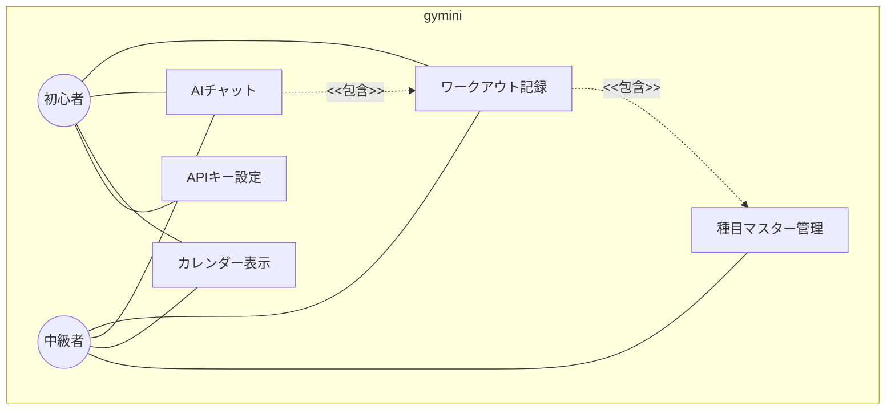

# gymini 要求仕様書

> **PRD の役割**: `docs/prd/` は「プロダクトとして何を・なぜ作るか」の唯一の真実。機能追加・変更時に更新必須。

## 概要

gyminiは、筋トレ記録とAIコーチングを組み合わせたWebアプリケーションである。ユーザーが自身のGemini APIキーを持ち込み（BYOK: Bring Your Own Key）、日々のワークアウト記録をAIが自律的に参照してパーソナライズされたアドバイスを提供する。

### ユーザー像

- **筋トレ初心者**: 何をすればいいかわからず、AIからのガイダンスを求める
- **中級者**: 蓄積した記録をAIで分析・最適化し、トレーニング効率を上げたい

### フェーズ構成

段階的にリリースする。各フェーズは以下の構成に対応する。ページ導線は [navigation.md](navigation.md) で定義する。

| FRAME | 画面 | 内容 | Phase | 要求仕様書 |
|:------|:-----|:-----|:------|:----------|
| FRAME1 | 🏋️ Training Idle | 待機画面・セッション開始 | 1 | [workout](workout/index.md), [navigation.md](navigation.md) |
| FRAME2 | 🏋️ Active Workout | 種目カード・セット記録・タイマー | 1 | [workout](workout/index.md), [exercise-master](exercise-master/index.md) |
| FRAME3 | 📅 History | カレンダー + 日付別記録サマリー | 1 | [history](history/index.md) |
| FRAME4 | 💬 AI Chat | AIチャット・Function Calling | 3 | [ai-chat](ai-chat/index.md) |
| FRAME5 | ⚙️ Settings | APIキー・種目マスター管理 | 2 | [settings](settings/index.md), [api-key](api-key/index.md), [exercise-master](exercise-master/index.md) |

---

# 1. 要求図の読み方

## 1.1. 要求タイプ

- **requirement**: 一般的な要求
- **functionalRequirement**: 機能要求
- **interfaceRequirement**: インターフェース要求
- **designConstraint**: 設計制約

## 1.2. リスクレベル

- **High**: 高リスク（ビジネスクリティカル、実装困難）
- **Medium**: 中リスク（重要だが代替可能）
- **Low**: 低リスク（Nice to have）

## 1.3. 検証方法

- **Test**: テストによる検証
- **Demonstration**: デモンストレーションによる検証
- **Inspection**: インスペクション（レビュー）による検証

## 1.4. 関係タイプ

- **contains**: 包含関係（親要求が子要求を含む）
- **derives**: 派生関係（要求から別の要求が導出される）
- **traces**: トレース関係（要求間の追跡可能性）

---

# 2. ユースケース図（概要）

---

# 3. 全体要求図（SysML Requirements Diagram）

```mermaid
requirementDiagram
    requirement GyminiSystem {
        id: REQ_001
        text: "筋トレ記録 × AIコーチングアプリ"
        risk: high
        verifymethod: demonstration
    }

    requirement WorkoutManagement {
        id: REQ_002
        text: "ワークアウト記録の管理機能"
        risk: high
        verifymethod: demonstration
    }

    requirement ExerciseMaster {
        id: REQ_003
        text: "種目マスターの管理機能"
        risk: high
        verifymethod: demonstration
    }

    requirement APIKeyManagement {
        id: REQ_004
        text: "Gemini APIキーの管理機能"
        risk: medium
        verifymethod: demonstration
    }

    requirement AIChatCoaching {
        id: REQ_005
        text: "AIチャットによるコーチング機能"
        risk: high
        verifymethod: demonstration
    }

    requirement CalendarView {
        id: REQ_006
        text: "カレンダーによる記録確認機能"
        risk: low
        verifymethod: demonstration
    }

    requirement UIDesign {
        id: REQ_007
        text: "スマホファーストのUI設計"
        risk: medium
        verifymethod: inspection
    }

    requirement AIWriteConfirmation {
        id: REQ_008
        text: "AIが書き込み操作（ワークアウト保存・種目追加）を実行する前にユーザー確認を求める"
        risk: high
        verifymethod: test
    }

    designConstraint TechStack {
        id: DC_001
        text: "Reactで開発し、クライアントサイドのみで動作する"
        risk: high
        verifymethod: inspection
    }

    designConstraint BYOKModel {
        id: DC_002
        text: "ユーザーが自身のGemini APIキーを持ち込むBYOKモデル"
        risk: medium
        verifymethod: inspection
    }

    designConstraint DataPersistence {
        id: DC_003
        text: "全データをブラウザのローカルストレージに保存（バックエンドサーバーなし）"
        risk: high
        verifymethod: inspection
    }

    designConstraint MobileFirstUI {
        id: DC_004
        text: "スマートフォンでの利用を最優先としたUI設計"
        risk: medium
        verifymethod: inspection
    }

    interfaceRequirement BottomNav {
        id: IR_001
        text: "2タブ（Training + History）+ AI専用ボタンのBottomNav"
        risk: medium
        verifymethod: inspection
    }

    interfaceRequirement GearIcon {
        id: IR_002
        text: "全画面の右上に歯車アイコン固定。タップで設定画面（FRAME5）へ遷移"
        risk: low
        verifymethod: inspection
    }

    requirement SettingsScreen {
        id: REQ_009
        text: "設定画面による一元管理（APIキー + 種目マスター）"
        risk: low
        verifymethod: demonstration
    }

    GyminiSystem - contains -> WorkoutManagement
    GyminiSystem - contains -> ExerciseMaster
    GyminiSystem - contains -> APIKeyManagement
    GyminiSystem - contains -> AIChatCoaching
    GyminiSystem - contains -> CalendarView
    GyminiSystem - contains -> UIDesign
    GyminiSystem - contains -> TechStack
    GyminiSystem - contains -> BYOKModel
    GyminiSystem - contains -> DataPersistence
    GyminiSystem - contains -> MobileFirstUI
    GyminiSystem - contains -> SettingsScreen
    UIDesign - contains -> BottomNav
    UIDesign - contains -> GearIcon
    SettingsScreen - contains -> APIKeyManagement
    SettingsScreen - contains -> ExerciseMaster
    UIDesign - traces -> MobileFirstUI
    AIChatCoaching - contains -> AIWriteConfirmation
    AIChatCoaching - traces -> WorkoutManagement
    AIChatCoaching - traces -> ExerciseMaster
    AIChatCoaching - derives -> APIKeyManagement
    CalendarView - traces -> WorkoutManagement
    ExerciseMaster - traces -> WorkoutManagement
```

---

# 4. 共通の設計制約

### DC_001: 技術スタック

Reactで開発し、クライアントサイドのみで動作する。

### DC_002: BYOKモデル

サーバーサイドでAPIキーを管理しない。ユーザーが自身のGemini APIキーをブラウザに保存し、クライアントサイドから直接Gemini APIを呼び出す。

### DC_003: データ永続化

全てのデータ（ワークアウト記録・種目マスター・APIキー）はブラウザのローカルストレージに保存する。バックエンドサーバーは使用しない。

### DC_004: スマホファーストUI

スマートフォンでの利用を最優先としたUI設計を行う。

### IR_001: BottomNav（2タブ + AI専用ボタン）

2タブ（Training + History）+ 右側AI専用ボタン（pill型）のBottomNavを提供する。スマホ画面下部に固定配置。FRAME1〜4で常に表示、FRAME5（設定）では非表示。詳細は [navigation.md](navigation.md) IR_001 を参照。

### IR_002: 歯車アイコン（全画面共通）

全画面（FRAME1〜4）の右上に歯車アイコンを固定表示。タップでFRAME5（設定画面）へ遷移。APIキー未設定時は赤バッジ表示。詳細は [navigation.md](navigation.md) IR_002、[settings/index.md](settings/index.md) FR_022 を参照。

---

# 5. 制約事項

## 5.1. 技術的制約

- Reactで開発（DC_001）
- データ永続化はブラウザのローカルストレージのみ、バックエンドサーバーなし（DC_003）
- AIモデルはGemini APIを使用（具体的なモデルは設計書で決定）
- APIキーはクライアントサイドで管理（DC_002: BYOK）
- スマートフォンファーストのUI設計（DC_004）

## 5.2. ビジネス的制約

- サーバーコストゼロ（静的ホスティングのみ）
- ユーザーデータはブラウザに閉じる（プライバシー重視）

---

# 6. 前提条件

- ユーザーがGemini APIキーを取得済み（または取得可能）であること
- モダンブラウザ（Chrome, Safari, Firefox最新版）での利用を想定
- ブラウザのローカルストレージが利用可能な環境であること

---

# 7. スコープ外

以下は本PRDのスコープ外とし、将来検討とする：

- 種目別の重量推移グラフ
- 部位タグ（AIの推論でカバーできると判断し保留）
- メニューテンプレート保存
- ExerciseMasterへの追加属性（部位・種別など）
- ユーザー認証・マルチデバイス同期
- データのエクスポート/インポート

---

# 8. 退役済み要求ID

| ID | 理由 |
|:---|:-----|
| FR_002 | 初期設計時に定義されたが、FR_001（セッションライフサイクル）に統合。欠番 |
| FR_004 | FR_019（セッション永続化、[navigation.md](navigation.md)）に移行。欠番 |
| FR_016 | FR_026（記録なし日の空状態、[history/index.md](history/index.md)）に機能統合。欠番 |

---

# 9. 用語集

| 用語 | 定義 |
|------|------|
| BYOK | Bring Your Own Key。ユーザーが自身のAPIキーを持ち込んで利用するモデル |
| ワークアウト | 1回のトレーニングセッション。日付に紐づき、複数の種目・セットを含む |
| セット | 1種目における1回の実施単位。重量(kg)・回数(reps)・メモで構成される |
| 種目（エクササイズ） | トレーニングの種類（例: ベンチプレス、スクワット、デッドリフト） |
| 種目マスター | アプリに登録された種目の一覧。ユーザーが自由に追加・削除できる |
| Function Calling | AIモデルが会話の文脈に基づいて、定義されたツール（関数）を自律的に呼び出す機能 |
| Gemini API | GoogleのAI APIサービス。本アプリではチャット会話とFunction Callingに使用 |
