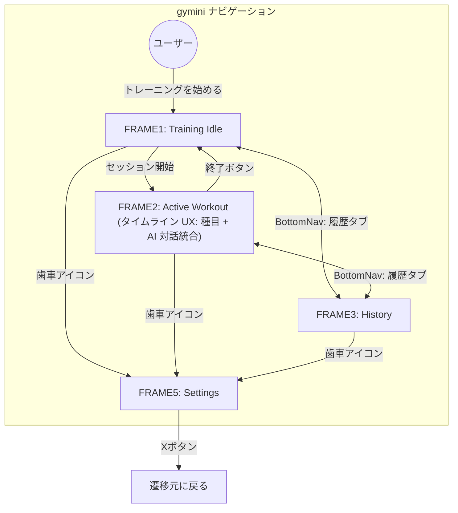
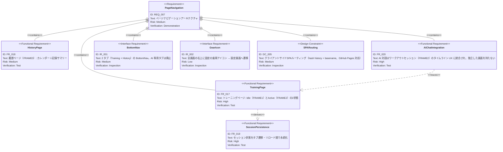

# ページナビゲーション 要求仕様書

**親要求:** [index.md](index.md) - REQ_007 (UI Design), IR_001 (ナビゲーション)

**関連要求:** [app-header.md](app-header.md) - 全画面共通の上部 chrome（タイトル・leading/trailing slot）

## 概要

gymini のページナビゲーションアーキテクチャを定義する。

- **BottomNav**: 2 タブ（Training + History）。AI 対話はワークアウトセッション内のタイムライン UX に統合されたため、独立した AI タブは持たない（[ai-chat/index.md](ai-chat/index.md) FR_034）
- **歯車アイコン**: 全画面の右上に固定、タップで設定画面へ遷移
- **ルーティング**: 4 つの論理画面（FRAME1, FRAME2, FRAME3, FRAME5）をクライアントサイドで管理。旧 FRAME4（独立 AI チャット画面）は段階的に撤去される（[ai-chat/timeline-migration.md](ai-chat/timeline-migration.md) Phase 8）

---

## 1. 画面遷移図



旧 FRAME4（独立 AI チャット画面）への遷移は撤去。AI 対話は FRAME2 のタイムライン内でのみ成立する。

---

## 2. 要求図（SysML Requirements Diagram）



---

## 3. 機能要求の詳細

### FR_017: トレーニングページ

アプリのメインページ。セッション状態に応じてFRAME1（Idle）とFRAME2（Active）を切り替える。

- **FRAME1（Idle）**: 挨拶 + 「トレーニングを始める」ボタン。詳細は [workout/index.md](workout/index.md) 参照
- **FRAME2（Active）**: 種目カード一覧 + セット記録。終了ボタンでFRAME1に戻る

**検証方法:** テストによる検証

### FR_018: 履歴ページ（FRAME3）

月表示カレンダー + 選択日の記録サマリー。詳細は [history/index.md](history/index.md) 参照。

**検証方法:** テストによる検証

### FR_019: セッション状態の永続化

BottomNavによるタブ遷移やブラウザリロードでセッションデータが失われないことを保証する。Zustandの`persist`ミドルウェアでlocalStorageに永続化。

**検証方法:** テストによる検証

### FR_020: AI 対話のセッション統合

AI 対話は独立した画面（旧 FRAME4）を持たず、ワークアウトセッション（FRAME2）のタイムライン UX 内でのみ成立する。

- AI への発話導線はセッション中の単一入力欄に集約される（[ai-chat/index.md](ai-chat/index.md) FR_035）
- セッション非アクティブ時は AI と対話できない。書き込みツールも `SESSION_NOT_ACTIVE` を返す（[ai-chat/index.md](ai-chat/index.md) FR_036）
- 旧 `/ai` ルート / FRAME4 / BottomNav 「AI」専用ボタンは段階的に撤去される（[ai-chat/timeline-migration.md](ai-chat/timeline-migration.md) Phase 8）
- API キー未設定時の導線は FRAME5 設定画面に集約（IR_002 歯車アイコンの赤バッジ）

**検証方法:** テストによる検証

## 4. インターフェース要求

### IR_001: BottomNav（2 タブ構成）

スマホ画面下部に固定配置。FRAME1〜FRAME3 で常に表示（FRAME5 では非表示）。

**レイアウト:**

```
┌────────────────┬────────────────┐
│    Training    │     History    │
└────────────────┴────────────────┘
       2 タブ（均等 flex-1）
```

旧 AI 専用ボタンは撤去。AI 対話は FRAME2 のタイムライン内のみで成立する（FR_020）。

**外観:**
- 高さ: セーフエリア込みで十分なタップ領域（T-003 準拠）
- 背景: 半透明フロストガラス（デザイントークン参照）
- 上部: 薄いセパレーター

**タブ状態:**

| 要素 | ラベル | アイコン | アクティブ | 非アクティブ |
|:-----|:-------|:---------|:-----------|:-------------|
| タブ1 | トレ | `ph-barbell` | 塗りつぶし・強調色・太字 | ミュートカラー |
| タブ2 | 履歴 | `ph-clock-counter-clockwise` | 塗りつぶし・強調色・太字 | ミュートカラー |

**遷移先:**

| 操作 | 遷移先 |
|:-----|:-------|
| トレタブ | FRAME1（Idle）/ FRAME2（セッション中の場合） |
| 履歴タブ | FRAME3 |

**検証方法:** インスペクションによる検証

### IR_002: 歯車アイコン（全画面共通）

全画面（FRAME1〜FRAME3）の右上に固定表示される歯車アイコン。タップで FRAME5（設定）へ遷移する。

**外観:**
- 画面右上に固定配置、スクロールしても常に表示
- 丸型ボタン、半透明フロストガラス背景
- アイコン: 歯車（Phosphor Icons `ph-gear`）

**APIキー未設定時のバッジ:**
- 歯車アイコン右上に赤ドットを表示（gym-accent 色）

**FRAME2 での追加要素:**
- 歯車の右隣に「終了」ボタン
- ボタン群の下にタイマー pill

**検証方法:** インスペクションによる検証

## 5. 設計制約

### DC_005: クライアントサイドSPAルーティング

3 つの論理ルート（`training`, `history`, `settings`）を TanStack Router の hash history モードで管理する。GitHub Pages 対応のため hash ルーティング（`/#/training` 形式）と basename（`/gymini/`）を使用する。

旧 `ai` ルートは段階的に撤去される（[ai-chat/timeline-migration.md](ai-chat/timeline-migration.md) Phase 8）。移行期間中は `/ai` を `/training` へリダイレクト、または「セッション開始へ誘導する空ページ」として残置する。

**検証方法:** インスペクションによる検証

---

## 6. フェーズ統合戦略

| Phase | 追加機能 | ナビゲーションへの影響 |
|:------|:---------|:---------------------|
| Phase 1 | ワークアウト CRUD、履歴 | FRAME1/2/3 が機能。AI 機能は未提供 |
| Phase 2 | 設定画面（APIキー・種目管理） | FRAME5 追加。歯車アイコン全画面表示 |
| Phase 3（旧）| 独立 AI チャット画面 | FRAME4 を一時的に追加（AI ボタン経由）。**Phase 4 で撤去** |
| Phase 4 | タイムライン統合 UX | FRAME2 に AI 対話を統合。FRAME4 と AI 専用ボタンを撤去（[ai-chat/timeline-migration.md](ai-chat/timeline-migration.md) Phase 1〜9）|

---

## 7. スコープ外

- HTML5 History API ベースルーティング（GitHub Pages 非対応のため hash routing を採用）
- ディープリンク / ブックマーク対応
- ページ間のトランジションアニメーション
- タブレット / デスクトップ向けレスポンシブレイアウト
