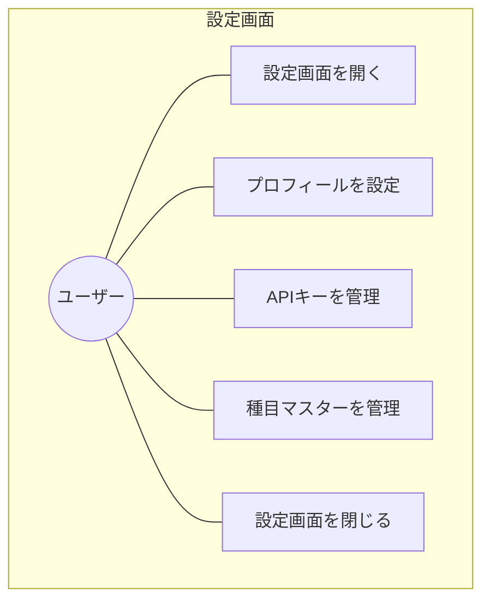
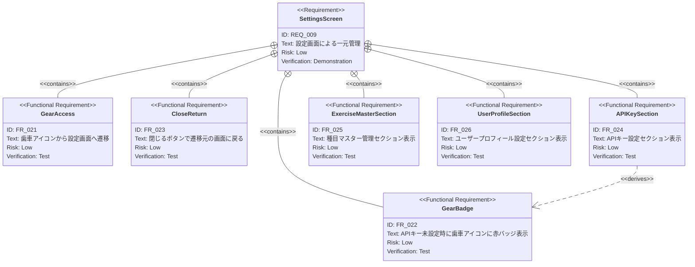

# 設定画面 要求仕様書

**親要求:** [index.md](../index.md)

**デザインリファレンス:** [design-system.html](../../design-system.html) FRAME5

> **統合画面:** APIキー管理（[api-key](../api-key/index.md)）と種目マスター管理（[exercise-master](../exercise-master/index.md)）のUIを単一の設定画面に統合する。各ドメインロジックの詳細は個別PRDを参照。

## 概要

アプリケーション全体の設定を管理する画面。歯車アイコンからどの画面からでもアクセスでき、閉じるボタンで遷移元に戻る。

---

## 1. ユースケース図



---

## 2. 要求図（SysML Requirements Diagram）



---

## 3. 機能要求の詳細

### FR_021: 歯車アイコンから設定画面へ遷移

全画面（FRAME1〜FRAME4）の右上に歯車アイコンボタンを固定表示する。スクロールしても常にアクセス可能。タップすると設定画面（FRAME5）へ遷移する。

**外観:** 丸型ボタン、半透明フロストガラス背景、歯車アイコン（Phosphor Icons `ph-gear`）

**検証方法:** テストによる検証

### FR_022: APIキー未設定時の赤バッジ

Gemini APIキーが未設定の場合、歯車アイコンの右上に赤いバッジ（ドット）を表示する。

**外観:** アクセント色（gym-accent）の小ドット、歯車アイコン右上に重ねて配置

**検証方法:** テストによる検証

### FR_023: 閉じるボタンで遷移元に戻る

設定画面の右上に閉じる（X）ボタンを固定表示する。タップすると設定画面を閉じて遷移元の画面に戻る。

**外観:** 歯車アイコンと同じスタイルの丸型ボタン、Phosphor Icons `ph-x`

**検証方法:** テストによる検証

### FR_026: ユーザープロフィール設定セクション

設定画面の最上部にプロフィール設定セクションを表示する。詳細な入力フィールド・AI 連携については [user-profile.md](user-profile.md) を参照。FR_026 は REQ_010（FR_031〜FR_034）を統合表示する。

**セクション構成:**
1. セクションラベル「プロフィール」
2. 生まれ年・体重・身長の数値入力フィールド
3. トレーニング目的の選択肢（5択）

**検証方法:** テストによる検証

### FR_024: APIキー設定セクション

設定画面上部にAPIキー管理セクションを表示する。詳細な入力・表示切替・削除機能は [api-key/index.md](../api-key/index.md) を参照。FR_024 は FR_008（入力・保存）、FR_009（表示切替）、FR_010（未設定警告）を統合表示する。

**セクション構成:**
1. セクションラベル「Gemini API」
2. APIキー入力フィールド（パスワードマスク + 目アイコンで表示切替）
3. 接続ステータス表示（接続済み / 未設定）
4. 削除ボタン

**検証方法:** テストによる検証

### FR_025: 種目マスター管理セクション

APIキーセクションの下に種目マスター管理セクションを表示する。詳細な検索・追加・削除機能は [exercise-master/index.md](../exercise-master/index.md) を参照。FR_025 は FR_007（種目CRUD）を統合表示する。

**セクション構成:**
1. セクションラベル「種目マスター」
2. 検索入力フィールド（リアルタイム絞り込み）
3. 種目一覧（各行に名前 + 編集ボタン）
4. 追加ボタン（`+` アイコン + 「種目を追加」ラベル）

**検証方法:** テストによる検証

---

## 4. 画面レイアウト

```
┌─────────────────────────────────┐
│ (sensor notch)                  │
│                          [  X ] │  ← 固定: 閉じるボタン
│                                 │
│  設定                           │  ← スクロールコンテンツ
│                                 │
│  ┌─ プロフィール ──────────────┐ │  ← FR_026（最上部）
│  │ 生まれ年       [1990    ]  │ │
│  │ 体重           [  70 ] kg  │ │
│  │ 身長           [ 175 ] cm  │ │
│  │ トレーニング目的            │ │
│  │ [筋肥大（サイズアップ）  ▼] │ │
│  └────────────────────────────┘ │
│                                 │
│  ┌─ Gemini API ───────────────┐ │
│  │ APIキー                     │ │
│  │ [●●●●●●●●●●●●●●●●●] [👁] │ │
│  │─────────────────────────── │ │
│  │ 🟢 接続済み        [削除]  │ │
│  └────────────────────────────┘ │
│                                 │
│  ┌─ 種目マスター ─────────────┐ │
│  │ [🔍 種目を検索...]         │ │
│  │─────────────────────────── │ │
│  │ Bench Press          [✏️]  │ │
│  │ Squat                [✏️]  │ │
│  │ Deadlift             [✏️]  │ │
│  │ Incline DB Press     [✏️]  │ │
│  │─────────────────────────── │ │
│  │ [+] 種目を追加             │ │
│  └────────────────────────────┘ │
│                                 │
└─────────────────────────────────┘
```

**Note:** 設定画面にはBottomNavを表示しない
