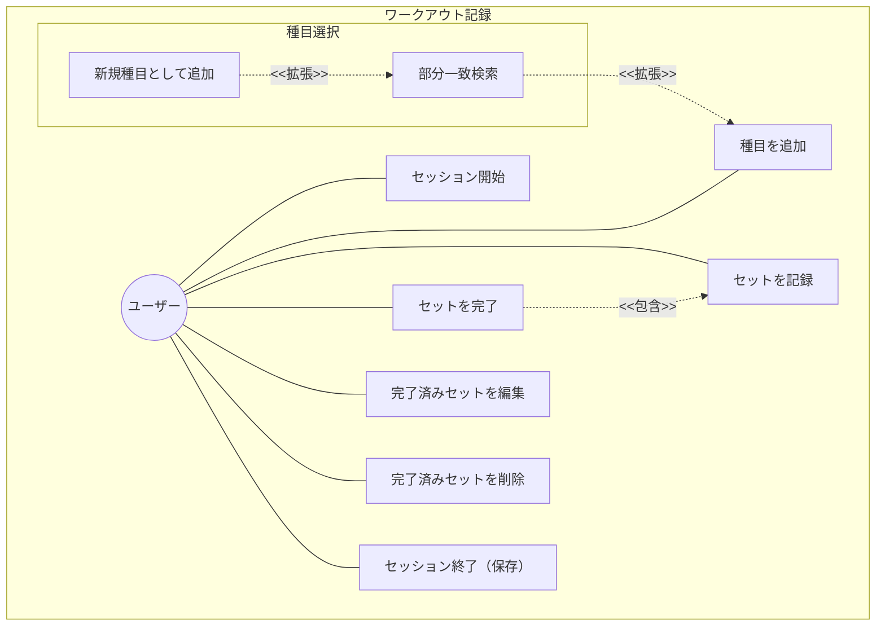
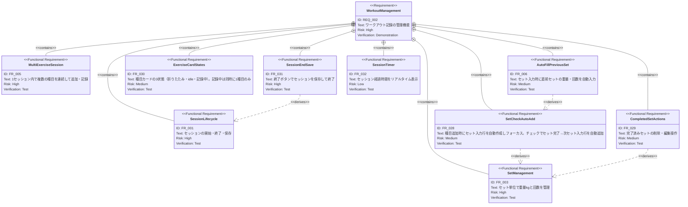
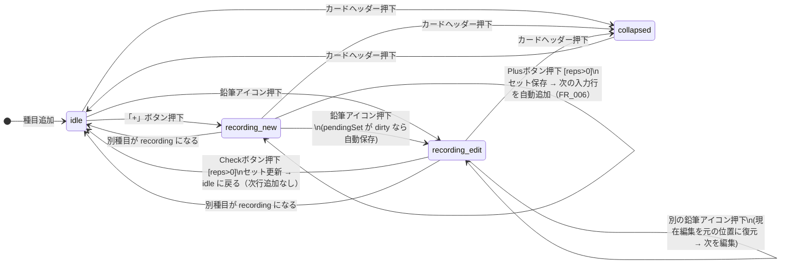

# ワークアウト記録管理 要求仕様書

**親要求:** [index.md](../index.md) - REQ_002

## 概要

ユーザーが日々のトレーニング内容を記録・管理する中核機能。ワークアウトは日付に紐づき、複数の種目とセットで構成される。セッション開始（FRAME1）→ タイムラインで種目カードと AI 対話を並走（FRAME2）→ 終了・保存（FRAME1 に戻る）のフローで運用する。

FRAME2 はワークアウトと AI チャットを統合した単一のタイムライン UX として運用する（[ai-chat/index.md](../ai-chat/index.md) FR_034）。

---

## 1. ユースケース図



---

## 2. 要求図（SysML Requirements Diagram）



---

## 3. 機能要求の詳細

### FR_001: セッションライフサイクル

FRAME1（Idle）で「トレーニングを始める」ボタンを押すとセッション開始。FRAME2（Active）へ遷移し、タイムライン上で種目追加・セット記録・AI 対話を行う。

**追加検証項目（[ai-chat/index.md](../ai-chat/index.md) FR_033 と整合）:**

- セッション開始時にチャット履歴が空になること
- セッション終了時にチャット履歴がクリアされること
- セッションがアクティブな間のみ、チャット履歴が localStorage に永続化されること（リロード復元）

**検証方法:** テストによる検証

### FR_003: セット単位の管理

各種目内でセット単位のデータを管理する。1セットは以下の情報を持つ:
- 重量（kg）
- 回数（回）

**検証方法:** テストによる検証

### FR_005: 複数種目の連続記録

1 回のセッション内で複数の種目を連続して追加・記録できる。種目の追加は **タイムライン下端の単一入力欄** から行う（[ai-chat/index.md](../ai-chat/index.md) FR_035）。

- 入力欄に種目名（例: 「ベンチ」）を入力すると候補チップが popover で提示され、タップで種目カードを追加
- 自然言語コマンド（例: 「ベンチ 60kg×10×3 で記録」）を送ると、AI が手入力と同じ通常カードをセッションへ即時挿入する（[ai-chat/index.md](../ai-chat/index.md) REQ_008）

旧「種目を追加...」専用検索フィールド（`ExerciseSearchField`）は撤去済み。種目検索は `ChatInput` の popover に統合された。

**検証方法:** テストによる検証

### FR_006: 前セットの値を自動入力

チェック後に自動追加される次のセット入力行に、直前セットの重量と回数を初期値として自動入力する。

**検証方法:** テストによる検証

### FR_028: セット入力行の自動作成と完了→次セット自動追加

**種目追加時:**
種目を追加すると最初のセット入力行が自動作成され、重量フィールドにフォーカスが移る。ユーザーは「+」ボタンを押す必要なく即座に記録を開始できる。

**新規セット完了ボタン（`ph-plus`）押下時:**
1. 入力中のセットが完了状態に変わる
2. 次のセット入力行が自動追加される（前セット値で自動入力: FR_006）

**別の種目を追加した場合:**
直前の種目に未完了の入力行がある場合、その入力行を消去して「+」ボタンに切り替える。これにより、同時に入力行（記録中状態）を持つ種目は常に1つだけになり、画面がスッキリする。

**UIスペック（新規セット完了ボタン）:**
- サイズ: 視覚サイズ `w-7 h-7`、タップ領域 `min-w-[44px] min-h-[44px]`（T-003 準拠: パディングでタップ領域を拡張）
- スタイル: `bg-black text-white rounded shadow-md`
- アイコン: `ph-plus`

**検証方法:** テストによる検証

### FR_029: 完了済みセットの削除・編集

完了済みセット行には左端にゴミ箱アイコン、右端に鉛筆アイコンを表示する。

- **ゴミ箱**: タップでそのセットを削除
- **鉛筆**: タップでそのセットを入力行に戻し、重量・回数を編集可能にする

**編集完了ボタン（`ph-check`）押下時:**
1. 編集中のセットが元の位置に再挿入される（末尾追加ではない）
2. 入力行が消去され、種目カードが **idle** 状態に戻る（次のセット入力行は自動追加されない）

**UIスペック（完了済みセット行）:**
- 背景: `bg-zinc-50 rounded-xl`
- ゴミ箱: `text-zinc-300`（控えめ）
- 鉛筆: `text-zinc-400`

**UIスペック（編集完了ボタン）:**
- スタイル: `bg-black text-white rounded shadow-md`（新規セット完了ボタンと同じ）
- アイコン: `ph-check`（新規セット完了ボタンの `ph-plus` と異なる）

**検証方法:** テストによる検証

### FR_030: 種目カードの状態と遷移

種目カードは以下の状態を持つ:

| 状態 | 説明 | 入力行ボタンアイコン |
|:-----|:-----|:---|
| **折りたたみ（collapsed）** | セット一覧非表示。セット数サマリー表示 | — |
| **待機（idle）** | 完了済みセット（あれば）+ 「+」ボタン。入力行なし | — |
| **記録中・新規（recording / editingSetIndex=null）** | 完了済みセット + 末尾に新規入力行 | `ph-plus` |
| **記録中・編集（recording / editingSetIndex≠null）** | 完了済みセット（編集対象を除く）+ 編集位置に入力行 | `ph-check` |

**状態遷移図:**



**記録中は同時に1種目のみ:** 「+」ボタンや種目追加で別の種目が記録中になると、現在記録中の種目は未完了の入力行を消去して idle に降格する。

**カードヘッダー共通:**
- 左: 三点メニュー（`ph-dots-three`）→ 並べ替え・削除
- 中央: 種目名（Outfit Bold、ふりがな不要）
- 右: caret-up（展開時）/ caret-down（折りたたみ時）

**検証方法:** テストによる検証

### FR_031: 終了ボタンでセッション保存・終了

FRAME2の右上に固定表示される「終了」ボタンを押すとセッションを保存して終了し、FRAME1（Idle）に戻る。「保存して終了」のような別途大きなボタンは設けない。

**UIスペック:**
- テキスト: 「終了」
- スタイル: `text-accent font-bold bg-red-50 px-3 py-1.5 rounded-lg`
- 位置: `absolute top-12 right-4`（歯車ボタンの右隣）

**検証方法:** テストによる検証

### FR_032: セッションタイマー

セッション開始からの経過時間をFRAME2の右上にリアルタイム表示する。歯車・終了ボタンの下に配置。

**UIスペック:**
- 形状: pill型（`rounded-lg`）
- 背景: `bg-white/80 backdrop-blur-sm`
- テキスト: `Outfit Bold text-xs`（例: 00:14:32）
- アイコン: `ph-clock`（accent色、`animate-pulse`）

**検証方法:** テストによる検証

---

## 4. 画面レイアウト

### FRAME1: Idle（セッション未開始）

```
┌─────────────────────────────────┐
│ (sensor notch)                  │
│                          [  ⚙·]│  ← 固定: 歯車（·=赤バッジ）
│                                 │
│  [avatar] 10月24日 (木)         │
│           こんにちは、タカさん    │
│                                 │
│         ( barbell icon )        │
│    準備はいいですか？             │
│                                 │
│  [  トレーニングを始める  ]      │  ← FRAME2へ遷移
│                                 │
│ [トレ]  [履歴]        [AI]     │  ← BottomNav
└─────────────────────────────────┘
```

### FRAME2: Active Workout（セッション中・タイムライン UX）

種目カード（ExerciseCard）と AI メッセージ（ChatMessage）を時系列で同一スクロール領域に並べる。**全ての種目カードは画面上部に sticky で固定され、次の種目カードに到達すると押し出される（stacking sticky section header）**。これにより、その種目の文脈（カードに紐づく後続 ChatMessage）をスクロール中もカードを常時参照できる。

```
┌─────────────────────────────────┐
│ (sensor notch)                  │
│                    [⚙] [終了]  │  ← 固定: 歯車 + 終了
│                       00:14:32  │  ← 固定: タイマー
│                                 │
│ ╔═ STICKY: 現在セクションの種目 Card ═╗ │  ← その時点のセクションのカードを上部固定
│ ║ [···] Incline DB Press [^]  ║ │
│ ║ [🗑] 30kg  10回      [✏️]  ║ │
│ ║ █ 2  [30] kg [10] 回  [+]   ║ │  ← recording 中は SET入力 UI が常時見える
│ ╚════════════════════════════ ╝ │
│                                 │
│  ── タイムライン（時系列） ──    │  ← スクロールコンテンツ
│                                 │
│  ┌─ Card: Squat (折りたたみ) ─┐ │
│  │ [···] Squat           [v]  │ │
│  │        2 Sets • Last: 80kg │ │
│  └────────────────────────────┘ │
│                                 │
│  💬 AI: 前回より 5kg 増えてる   │
│                                 │
│  ┌─ Card: Bench Press (idle) ┐ │
│  │ [···] Bench Press     [^]  │ │
│  │ [🗑] 60kg  10回      [✏️] │ │
│  │ [🗑] 60kg  8回       [✏️] │ │
│  │          [ + ]              │ │
│  └────────────────────────────┘ │
│                                 │
│  ─ ユーザー: 「ベンチ60kg ×3」  │
│                                 │
│  ┌─ Card: Bench Press (idle) ┐ │  ← AI 挿入も手入力と同じ通常カード
│  │ [···] Bench Press     [^]  │ │
│  │ [🗑] 60kg  10回      [✏️] │ │
│  │ [🗑] 60kg  10回      [✏️] │ │
│  │ [🗑] 60kg  10回      [✏️] │ │
│  │          [ + ]              │ │
│  └────────────────────────────┘ │
│                                 │
│ ╔═ FIXED: 単一入力欄 ════════╗  │
│ ║ [種目名 / 自然言語コマンド] ║  │  ← FR_035 単一入力欄
│ ╚═══════════════════════════ ╝  │
│                                 │
│ [トレ]    [履歴]                │  ← BottomNav（AI タブ撤去後の 2 タブ）
└─────────────────────────────────┘
```

- 種目カードと ChatMessage は `timestamp` でマージしてレンダリング
- **全ての種目カードを `position: sticky` で上部固定**。containing block を「カード + 次の種目までの ChatMessage」のセクション単位にすることで stacking 化し、次の種目カードに到達すると前のカードが押し出される（同時に 1 種目のみ recording に入れるルールは FR_030）
- AI が挿入するカードは手入力と同じ通常 ExerciseCard。セット編集は `PendingSetRow` / `CompletedSetRow` で行う（[ai-chat/index.md](../ai-chat/index.md) FR_013）
- 旧 BottomNav の「AI」専用ボタンは撤去（[navigation.md](../navigation.md) IR_001 改訂を参照）

---

## 5. スコープ外

- ワークアウト全体のメモ機能（将来検討）
- セット単位のメモ機能（将来検討）
- 体重の自動増減提案
- セット間レスト計測
- 過去ワークアウトに紐づく AI 対話履歴のアーカイブ閲覧（将来要件、[ai-chat/index.md](../ai-chat/index.md) FR_033 のスコープ外節と整合）
